# Clannad Season 1 Episode 1-4 Plot Highlight

## 1. 在樱花飘舞的坡道上

- 在樱花坡道, 与古河渚第一次见面
- 介绍基友和宿舍
- 光世界, 简介, 机器人未出生
- 介绍椋与姐姐杏, 杏对朋也的明日上学路上的桃花运表示有意思
- 在学校广场，与古河渚一起吃午餐, 渚说明了留级情况, 朋也鼓励去演习部, 互相认识
- 介绍坂上智代
- 演习部废止, 朋也安慰渚, 被椋看见
- 街上和山头浪费光阴
- 放学时在人行横道, 渚介绍自己家
- 来古河面包房, 介绍父母和古河家庭
- 最后介绍朋也家庭情况, 和父亲和关系, 逃出家后遇见渚练习演习

### Highlight 地点

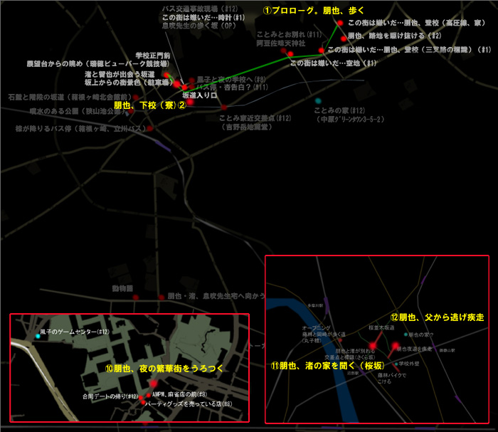

讨厌这个小镇

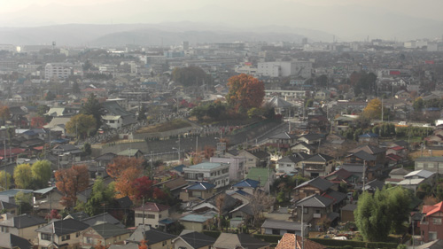

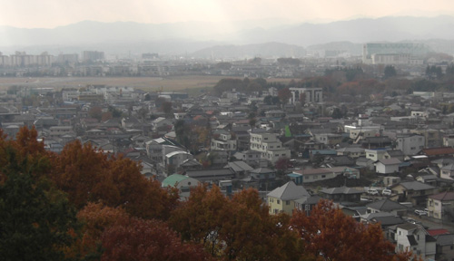

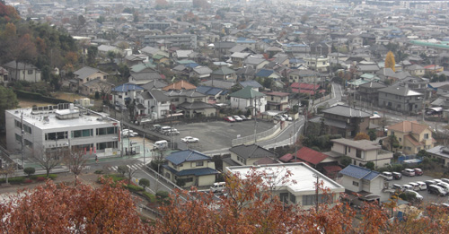

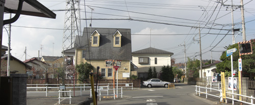

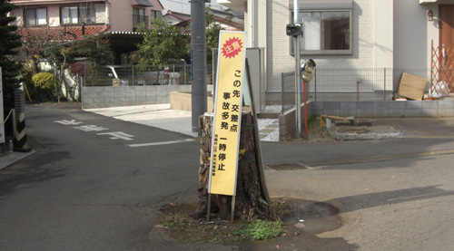

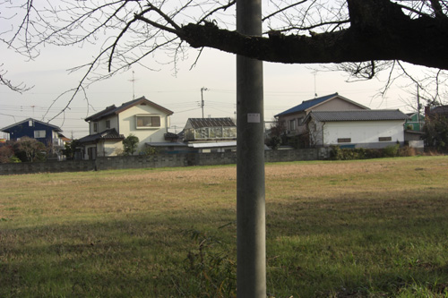
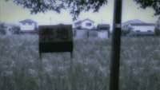

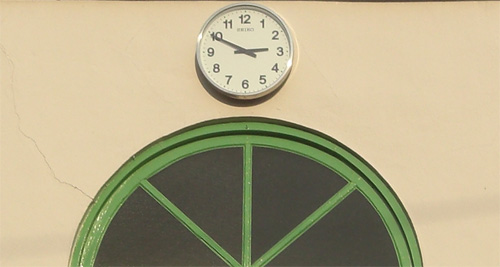

放学后的无所事事

放学时渚介绍自己家

从渚家出来

从家里逃出去

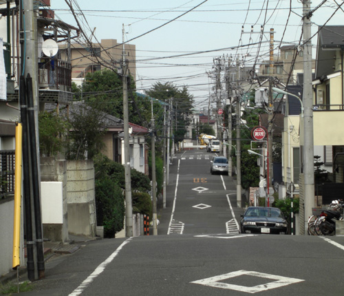
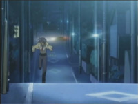

## 2. 最初的一步

- 渚练习演习

- 光世界中，少女独自拼接机器, 机器人愿意追随这个唯一的温暖

- 上学路上，杏遭遇事件（疑似对应第一集的椋的占卜）
- 智代表示看到朋也和渚让她怀念过去
- 介绍琴美，提到她是年级前十
- 中午，与古河渚讨论如何募集演习部部员
- 介绍幽灵女孩的传闻
- 为古河渚制作团子大家族，中途逃离父亲
  - 古河渚透露自己失落的原因是因为一直孤单一人
  - 朋也也透露因某些原因放弃了篮球
  - 古河渚提议陪朋也一起打篮球
- 下雨天，古河渚冒雨前来，为了报答一直依靠朋也的帮助
  - 古河渚想看朋也投篮，但朋也因与父亲打架导致右肩受伤
  - 古河渚因自卑和身体虚弱而生病

### Highlight 地点

早上和杏撞上

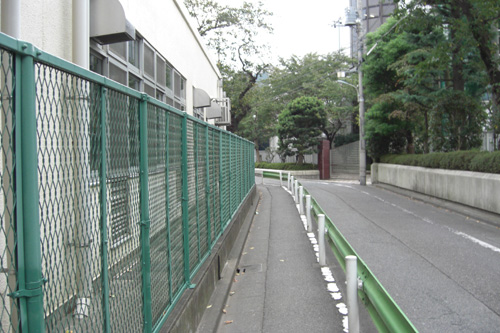
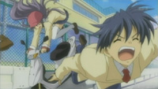

朋也出逃

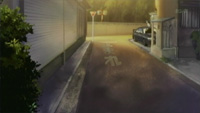
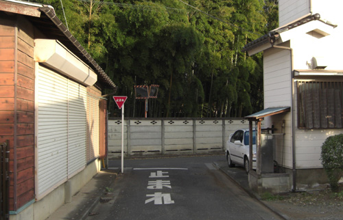

与渚谈心并建议篮球

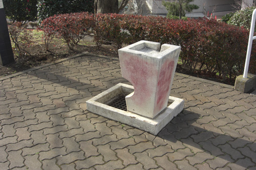
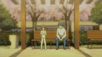

## 3. 泪水之后再来一次

- 光世界中，追随温暖的机器人诞生了

- 朋也看望病倒的古河渚
- 介绍音乐人方野
- 智代第三次
- 中午一个人吃饭的古河渚, 朋也表示想哭可以依靠他, 不无聊
- 开始进入风子线, 归还小刀
- 介绍杏的小猪
- 介绍宫泽有纪宁
- 尝试练习复活演习部的介绍
  - 透露为什么喜欢演习, 因为一直向往与大家一起, 但可惜高中一直休学
- 可惜海报被学生会收回

### Highlight 地点

上学路上的放野

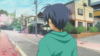

## 4. 寻找伙伴

- 朋也尝试帮助渚募集成员, 即使学生会阻止, 安慰渚
- 智代第4次
- 风子介绍姐姐结婚, 对象为方野, 希望朋也和大家现场祝贺
  - 所以才分发星星礼物
  - 风子姐姐以前时美术老师
- 智代透露自己想改变自己的形象 (更女生一些)
- 损招把椋叫来, 古河渚介绍演习部, 被误以为是女同表白
- 重新给椋和杏介绍了演习部复部,
- 智代第5次, 朋也出损招, 智代表示要竞选学生会长
- 朋也尝试邀请琴美去演习部
- 朋也邀请风子去演习部, 正式进入风子线
  - 风子本应该处于车祸在医院状态

### Highlight 地点

无

## 1-4集总结

- 基本上介绍各个人物+进入风子线
- 渚和朋也的互相治愈
- 以演习部为契机, 开启Galgame各个线
