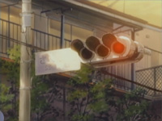
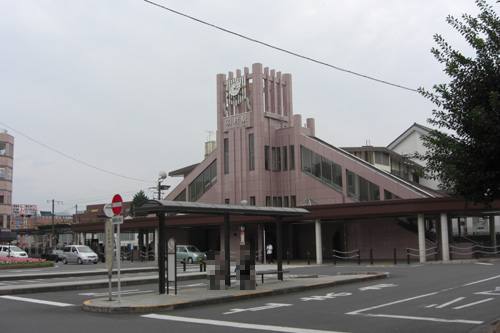
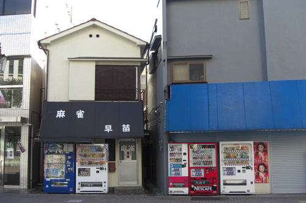
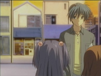
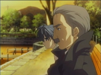
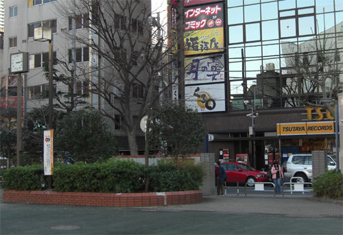

# Clannad Season 1 Episode 10-14 Plot Highlight

## 10. 天才少女的挑战

- 光世界, 好奇这些光是什么
  - 请注意此时, 风子的光玉已获得
  - 是影子, 是每个"\[平凡\]的景色"影子呢

- OP出现第二颗光玉 (风子的光玉)

- 渚和朋也一起上学
  - 再次撞见杏
- 拉琴美进演剧部, 正式开始琴美线
  - 琴美和古河渚以奇怪的对话相识
- 送琴美回家
  - 琴美表示怕生, 但对朋也和渚表示还行
- 和琴美去书店买书
  - 朋也看到减书行为表示需要帮琴美多认识人
- 带琴美去认识杏
  - 杏表示自己和妹妹的对手增加了
  - 也成为了琴美的朋友
- 带琴美去认识椋
  - 椋占扑无法交到朋友, 但椋成为朋友
- 带琴美认识智代
- 通过小卖部阿姨得知琴美父母是知名学者
- 杏借助和琴美搞好关系的契机为自己和椋制造跟朋也搞好关系的机会, 但朋也把她们带到了演剧部
  - 但也让所有人互相认识
- 琴美被小提琴吸引, 拉出尖叫声
- 一位神秘人登场

### Highlight 地点

椋下车车站

朋也和渚的上学路

朋也送琴美回家

有一个书店的地点, 但觉得地点牵强, 不大像

## 11. 放学后的狂妄曲

- 琴美用小提琴与大家打招呼
- 放学后在演剧部, 琴美尝试吐槽
  - 大家以及打好关系
- 杏想把琴美从朋也支走iu, 创造两人环境
- 杏与朋也在公园
  - 杏的暗示告白, 也是为妹妹着想
- 琴美周日也在, 朋也听到了小提琴也去
  - 一起吃了琴美自制的苹果派
  - ["前天看到了小兔，昨天是小鹿，今天是你"](https://zh.moegirl.org.cn/zh-hans/%E5%89%8D%E5%A4%A9%E7%9C%8B%E5%88%B0%E4%BA%86%E5%B0%8F%E5%85%94%EF%BC%8C%E6%98%A8%E5%A4%A9%E6%98%AF%E5%B0%8F%E9%B9%BF%EF%BC%8C%E4%BB%8A%E5%A4%A9%E6%98%AF%E4%BD%A0)
  - 琴美想两个人一起看书
  - 朋也做了奇怪的梦, 梦见什么精神分裂
- 在神社⛩面前分别, 琴美表示朋能来感到开心
- 琴美的小提琴会
  - 智代遇见佐枝, 佐枝是曾经的传奇学生会长, 智代想要请教
  - 也算是帮助琴美克服怕生
- 放学后, 遇到琴美的坏人
  - 朋也听到杏和椋谈论起琴美是情敌

### Highlight 地点

放学后的暗示表白地点

周日朋也出门

朋也与琴美周末图书馆后回家分别处的神社⛩

以及樱花道, 详见common place

## 12. 被隐藏的世界

- 琴美归还了小提琴
  - 朋友逐渐增多, 为此感到高兴而流泪
- 琴美开始去教室听课
- 也跟演剧部的大家关系更好, 还做了便当🍱
- 周末一起是商店街
  - 大家决定一起为下周6生日的琴美送礼物
- 娃娃机抓礼物, 真风子出现, 大家已无印象但感觉见过
  - 虽然没拿到
  - 琴美有心事
- 在两人回家路上, 琴美希望朋也拿着这本书就好, 即使不读
- 大叔再次出现, 朋也带着甩开
- 朋也梦见小时候的梦
- 早上琴美胸袭, bus翻车事件
  - 琴美恐慌, 另有隐情
- 渚, 朋也, 椋, 杏, 决定去琴美家看望
  - 黑色的蝴蝶
  - 朋也在意那个房子, 返回去了
- 朋也遇到了大叔, 以前同为研究员, 朋也得知了琴美的父母的秘密
  - 父母是发现了宇宙形成过程中脱落下来的\[隐藏的世界\](暗指光世界), 但因(可能是政治原因)而..
- 大叔希望朋也转告给琴美, 朋也前去琴美家
  - 也发现了琴美父母因飞机事故去世
  - 朋也想起以前与琴美见过

### Highlight 地点

商店街

分别路上

朋也和琴美回家路上

车祸现场

琴美家前面 (无法找到)

大家返回后朋也决定再次返回

琴美家的背面, 朋也返回琴美家

(因为隐私原因不能直接公开地址. hint 1: BV1km4y1b7oV讲了小区的地址. hint 2: Clannad DVD第5卷表纸 中的琴美基本已经到家了)

 (琴美家的拐口)

 (表纸左边那栋)

与黑衣大叔交谈

最后

 (表纸出口正前方那栋的侧面)

 (BV1km4y1b7oV视频截图)

## 13. 让回忆的庭院

- 琴美表示对忘记自己的朋也不知所措

- OP出现第三颗光玉 (琴美的光玉? 琴美线还没结束啊, 还是杏之前表白的光玉? 大概率事琴美的)

- 琴美背景
  - 世界由大量\[竖线/光玉/竖琴\]连接, 每个光玉都有声音, 交错在一起就是美丽的声音->世界
    - 琴美名字来源于此
  - 小时候过于聪明, 因此学校无朋也, 对朋也的闯入感到不一样
  - 生日快到时, 原本打算陪琴美的父母需要出差,
  - 琴美走前说了最讨厌爸妈
  - 结果飞机失事(可能是政治原因)
  - 朋也也没来
  - 有\[坏人\]要来进家取走论文副本, 琴美之后烧掉桌子上的一封信
  - 之后琴美一直在赎罪, 一直在剪带有父母名字的书, 并萌生想要继承爸妈事业的想法
- 琴美打算美国留学
- 朋也打算再去一次琴美家, 做一些力所能及的事
  - 朋也除草种花
  - 渚, 杏, 椋调整修复小提琴
  - 晚上大家一起除草, 琴美有在感受到

### Highlight 地点

## 14. Theory of Everything

- 大家继续除草干活

- 朋也通宵干了一夜, 早上干完了, 读起之前琴美给的书, 睡着了
- 朋也想起来小时候, 以及那句书中的话
  - 那时生日想带同学去琴美家过生, 因为没能邀请到任何人, 朋也没脸进去
  - 等深夜再去时, 桌子正在燃烧
  - 坏人灭了火, 解释了信不是论文
  - 之后朋也再也未见, 也忘记了
- 醒来时, 一切已经都想起来, 琴美心结打开
- 大家迎接琴美上学, 同时黑衣人带了之前父亲的箱子
  - 里面是玩具熊
  - 其实时飞机失事时, 父母把论文换掉, 装进了玩具熊
- 飞机失事后, 箱子浮到岸边, 几经世界周转, 回到琴美手中
  - 象征父母对琴美的生日祝福

### Highlight 地点

 (表纸出口正前方那栋的前门)

 (表纸右边那栋)

## 琴美家附近房子方位图

来自[お箸が重い的CLANNAD第14集攻略](http://air.blue.coocan.jp/cla-14.html)

1,2为表纸左右两边的房子 

(我不能再hint下去了, 再hint就差直接报地址了)
