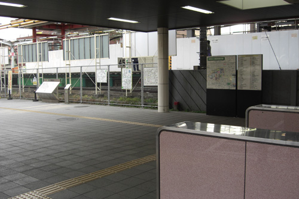
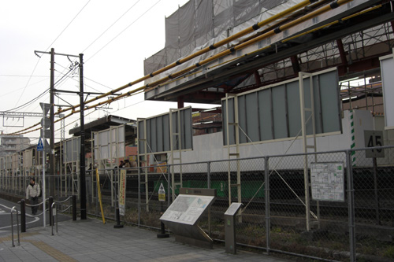
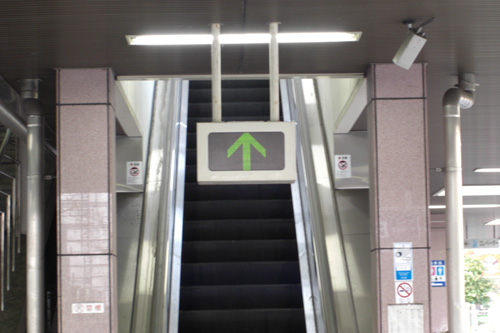

# Clannad Season 1 Episode 15-19 Plot Highlight

其他共同线, 包括春原兄妹, 智代, 杏, 椋

## 15. 与你同在的光

- 光世界, 新光玉产生 (这才是琴美的?)

- 大家挂名演剧部
- 但是剥夺了原本借给琴美的那个小提琴仁科三人组的合唱组的资格
  - 此时, 琴美, 杏, 椋, 渚 和 朋也的组合已经形成

- 春原妹妹打电话了, 朋也恶作剧接了
- 古河渚收到恐吓信
- 春原去调查了, 揪出来人偶, 是仁科的同学之一
- 渚与仁科的同学交流, 渚同意为合唱部放弃演剧部
  - 春原激励劝说, 无果
  - 朋也导出春原因与前辈打架, 被迫退出了足球部
  - 即使无法重组演剧部, 至少5人小组的友谊更珍贵
  - 但是春原和杏不同意放弃, 春原另找办法去了
- 朋也遇到智代, 帮忙为智代摆脱一直纠缠不放的柔道部
  - 智代对朋也好感up
- 春原打算通过打篮球击败篮球部为演剧部赢得资格
- 无意中让春原误以为朋也和渚两人正在交往
- 春原芽衣登场

### Highlight 地点

common 樱花坡道

## 16. 3 on 3

- 妹妹打扫房间

- OP光玉4个了(春原兄妹的?)

- 误会解除了
- 让芽衣住渚家
- 智代拉着朋也去学校被杏看见
- 明天的篮球比赛叫上杏, 杏要求与朋也中午见面
- 智代中午见朋也, 被杏怼上了
  - 杏把朋也从智代身边拉走
  - 智代承认可能也喜欢朋也
- 朋也, 杏, 椋三人的午餐
  - 椋反应暗示也喜欢朋也

- 三人篮球比赛, 朋也绝杀
  - 朋也至此也找到了努力的目标---渚
- 芽衣回去了

### Highlight 地点

common 樱花道

车站 (其中一个表纸也在)

