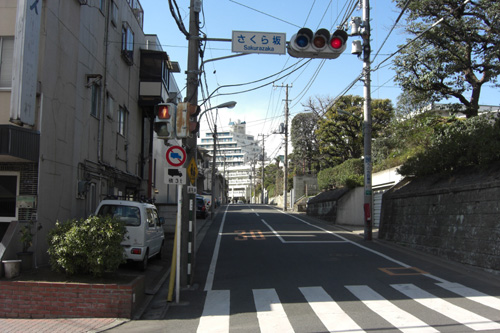
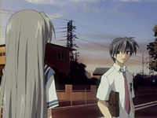
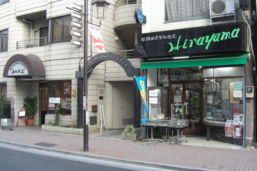
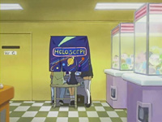
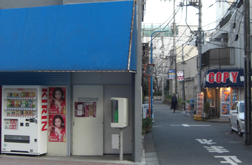
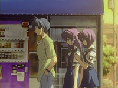
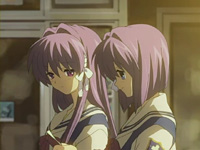
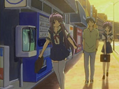

# Clannad Season 1 Episode 15-18 Plot Highlight

共同线+一点春原兄妹线+智代线+杏椋姐妹线 综合

## 15. 与你同在的光

- 光世界, 新光玉产生 (这才是琴美的?)

- 大家挂名演剧部
- 但是剥夺了原本借给琴美的那个小提琴仁科三人组的合唱组的资格
  - 此时, 琴美, 杏, 椋, 渚 和 朋也的组合已经形成

- 春原妹妹打电话了, 朋也恶作剧接了
- 古河渚收到恐吓信
- 春原去调查了, 揪出来人偶, 是仁科的同学之一
- 渚与仁科的同学交流, 渚同意为合唱部放弃演剧部
  - 春原激励劝说, 无果
  - 朋也导出春原因与前辈打架, 被迫退出了足球部
  - 即使无法重组演剧部, 至少5人小组的友谊更珍贵
  - 但是春原和杏不同意放弃, 春原另找办法去了
- 朋也遇到智代, 帮忙为智代摆脱一直纠缠不放的柔道部
  - 智代对朋也好感up
- 春原打算通过打篮球击败篮球部为演剧部赢得资格
- 无意中让春原误以为朋也和渚两人正在交往
- 春原芽衣登场

### Highlight 地点

common 樱花坡道

## 16. 3 on 3

- 妹妹打扫房间

- OP光玉第4个出现(谁的?)

- 误会解除了
- 让芽衣住渚家
- 智代拉着朋也去学校被杏看见
- 明天的篮球比赛叫上杏, 杏要求与朋也中午见面
- 智代中午见朋也, 被杏怼上了
  - 杏把朋也从智代身边拉走
  - 智代承认可能也喜欢朋也
- 朋也, 杏, 椋三人的午餐
  - 椋反应暗示也喜欢朋也

- 三人篮球比赛, 朋也绝杀
  - 朋也至此也找到了努力的目标---渚
- 芽衣回去了

### Highlight 地点

common 樱花道

common 车站 (其中一个表纸也在)

## 17. 不在的空间

- 幸存老师兼顾合唱部和演剧部, 但是不行
- 渚病倒

- 大家送渚回家
- 智代叫朋也起床
  - 也顺带把春原叫起来
- 杏再次邀请朋也午餐
  - 撮合椋和朋也
  - 但是椋介意伤害渚
  - 杏认为不能被别的女孩包括智代抢走
- 回家
  - 朋也说不想交女朋友, 被智代听见
  - 杏和椋发现智代先到了
- 春原带着智代到混混街上, 揭秘智代秘密一角
  - 朋也带着智代离开, 去了cafe
  - 智代感谢朋也, 好感度up
- 又一次被智代叫醒, 明显智代很高兴
- 再一次跟椋和杏午餐
  - 但是椋做的没做好
- 渚不在演剧部教室, 朋也一人思意着渚

- 朋也去那个图书馆室, 做了一个会和想见的女孩被所在体育仓库里的魔咒
- 真的被锁了, 锁住期间:
  - 杏害怕, 说漏嘴把椋的感情说出来了
  - 听到朋也魔咒指了杏, 杏有些高兴
  - 但是朋也表示感觉到了杏的午餐用意是为了撮合椋和朋也
  - 杏也感觉到朋也对椋和杏没有太多感觉, 感觉午餐时麻烦
- 出来了, 误会接触
- 再次和智代回家
  - 之前的混混堵门口找智代
  - 学校主任来了, 看到情况后, 朋也站出来全部拦上
  - 朋也被停学

### Highlight 地点

智代回家

## 18. 逆转的秘诀

- 智代又来朋也家, 做了早餐
  - 与父亲不和
- 学校的大家思绪着渚和朋也
- 朋也一个人思绪着渚
- 杏和椋带着朋也出去约会
  - 朋也无意间透露不是渚有点失望
- 游戏厅里的占扑游戏
  - 杏撮合着椋和朋也, 自己也慢慢伤心
  - 结果显示两人关系是朋也, 不是恋人
  - 椋有些欣慰
  - 翻译: 温柔的女性和有责任感的坚强男性。作为朋友的相性相当好。能否发展成更深的关系取决于两人的心意……
- 最后杏让朋也送椋回家
- 椋: 占扑说不中也没关系, 那样也好, (个人理解: 因为我不想伤害渚)
- 智代周日也来给朋也做饭
  - 选举, 可能不太好?
- 椋, 杏, 琴美都来送料理了
  - 后宫起火
- 朋也返校, 但智代因之前事件被打成不良女
  - 为了改善形象, 让智代击败其他运动俱乐部
- 回家樱花路上, 智代讲述起为了保护樱花坡道而参加学生会的原因
  - 家庭分裂, 弟弟跳河威胁父母不离婚
  - 之后弟弟治愈后, 说每年都要和家人一起来这片樱花坡道
- 渚痊愈返校了
- 智代的网球比赛 (除渚以外所有人成败犬)
  - 杏和椋看见朋也和渚在一起欣赏着智代的比赛
  - 椋阻止了杏, 明白已经比不过渚了
  - 智代看见了渚, 明白了一直以来朋也说的"为了演剧部"其实是为了渚, 也明白了自己也不比不过渚
  - 球一不小心打到古河渚, 朋也下意识保护, 甚至不让其他男性碰. 虽然自己也发现行为不好, 但慢慢带着渚去保健室
  - 看见这一幕的杏和椋止不住痛哭
  - 智代也长舒一气
- 智代当上学生会长

### Highlight 地点

商店街约会

 与风子的第12集一致

common 车站

其他场景

common 樱花坡道

与弟弟见面 (法名寺横・鬼子母神)

弟弟跳河

common 樱花坡道

## 15 - 18集总结

其实通过渚与朋也的短暂离开 (渚生病, 朋也停学), 朋也意识到自己心中已经是渚了
即使任由智代, 杏, 椋趁渚不在攻略朋也, 朋也心中始终是渚,
这场离别, 让两人感情急剧升温, 最终让智代, 杏和椋放弃
