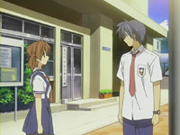
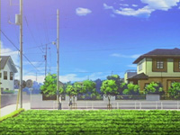
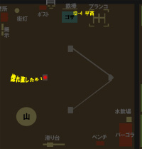
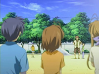
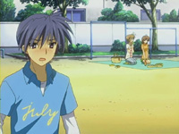
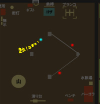
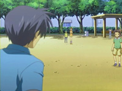

# Clannad Season 1 Episode 19-22 Plot Highlight

## 19. 新的生活

- 演剧部成立, 目标学园祭出演

- 朋也被叫去老师要家庭访问
  - 朋也想逃被渚拉回来

- 第5个光玉出现(智代的?)

- 老师来到家里, 父亲不在, 朋也逃出来,又被渚抓住了
- 老师见到了父亲, 朋也说出了家庭现状, 渚提议朋也去渚家住
- 父亲见到朋也拿着大包出门, 觉得寂寞
  - 朋也来到渚家寄宿
- 演剧需要多人配合, 灯光, 乐器, 道具
  - 春原可以负责键盘
  - 渚不知道给要演的戏取什么标题
- 朋也和渚回家, 看见早苗再教课
  - 在意以前渚母亲早苗(以下都用早苗代替渚母亲)为什么不当老师了
- 晚上渚进朋也房间, 两人对同居感到不可思议
  - 渚坦白小时候做了一件对不起父母的事, 但父母不提

- 光世界, 机器人正在拼装另一个机器人朋友

### Highlight 地点

common 樱花坡道

common 风子路口

common 朋也家

逃出来的朋也 (同第12集的车祸现场, 也是樱花坡道的十字路口开始处)

渚拉着朋也回去

 (与第17集智代回家是一个场景)

 (感觉背景不像)

common さくら板

## 20. 被隐藏的过去

- 渚在自家前的公园练习发声
  - 渚已经习惯了朋也
- 渚想要演很久很久以前光世界的故事, 悲伤的, 只有少女一人的故事
  - (注意在光世界里机器人总是说很久以前**和**遥远的未来两个时间点, "很久以前"可以在这里对应)

- 光世界, 新的机器人拼好, 但没有用

- 朋也也感觉在哪见过这个光世界故事
  - 问了问渚父亲秋生 (以下都用秋生代替渚父亲), 不知道
  - 朋也去问早苗, 但秋生感觉到这件事需要隐瞒渚
  - 早苗也不知道, 但朋也总感觉这个故事很重要
  - 早苗提议去找找这个故事的连环画或者录像
- 在有纪宁图书馆那里朋也问表白的事, 可能觉得男方主动表白
- 渚召集演剧部, 说明了光世界故事, 朋也表示绝对有印象
- 秋生阻止了渚和朋也去后院储物室, 里面藏着渚父母年轻时候的追梦
- 秋生坦白了:
  - 以前父母都为梦想而忙
  - 有一次两人都撂下发烧的渚去上班, 发烧的渚去外面等父母, 父母痛苦
  - 之后父母决定为了渚开面包店
- 看见渚一家的和睦相容, 朋也深夜想起了父亲
- 因为没有过过一家三口的日子, 朋也决定不参加第二天的野餐
  - 被春原好哥们说回去了, 点醒了朋也, 渚的自信是朋也在背后支持的
- 因为时间关系就在自家公园前野餐
- 被父母助攻朋也和渚的关系up

### Highlight 地点

common 樱花坡道

渚父母以前的公寓

野餐去家门口

使用以下Google地图对照

## 21. 

- 开始了演剧部练习和准备
- 看了秋生的演剧录像
- 之后朋也和秋生开始找起了渚提过的光世界故事
  - 但秋生确信这个故事一定不是小时候渚看过的故事
- 古河渚想要配乐, 请来了之前的合唱部
  - 一切正常进行中
- 学园祭前一天彩排, 大家一起打气
- 学园祭前一天晚上, 渚再次提起之前对不起父母的事
  - 朋也开导渚不要都怪罪自己
- 渚去找手电途中无意翻出父母以前的照片
  - 止不住的翻看照片到3点, 对父母为了自己放弃梦想而感到自责

### Highlight 地点

风子路口

## 22. 形影不离

- 大早上去学园祭路上, 渚不断自责自己断送父母的愿望, 朋也安慰

- 第6个光玉出现(古河渚父母的?)

- 到学校, 大家尝试振作渚, 但渚依然垂头丧气
- 朋也带着渚学园祭自由活动, 但依然心不在焉
  - 结果走散了
  - 早苗阿姨到了, 但秋生还有点事一会再来
- 渚来到有纪宁图书馆, 找秋生父亲以前的演剧
  - 渚还在自责, 朋也安慰渚说做好自己就行

- 出场会渚依然自责, 秋生大叔出现解开渚心结
  - 朋也也出现让渚意识到她被大家寄托的
- 演出开始, 是光世界的演出

- 光世界: 少女把之前拼起来的动不起来的机器人埋了
  - 因为这里是不会有别的生命的世界
  - 机器人依然说: 在很久的过去和未来, 他曾存在于现实世界, 现在回不去了
  - 机器人说一起做别的让人兴奋开心的东西
    - 只为了和少女两人在一起
      - 总有一天离开这个光世界, 前往现实世界

- 演出结束, 渚想起来下文
  - 机器人与少女决定一起离开光世界, 前往温暖的世界
- 朋也父亲也来了, 受渚的邀请
  - 父子两人稍微见面, 父亲便离开了, 朋也不忘劝告不要喝太多酒

- 欢庆

- 朋也告白

### Highlight 地点

common 樱花坡道

## 19 - 22 集总结

通过朋也离开去古河渚家住,
主要讲述了**古河渚父母的过去**, 以及对古河渚的影响.
同时演剧部顺利演出,
朋也和渚最后确认关系
