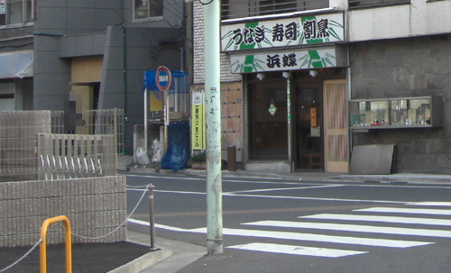
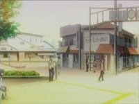
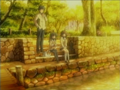

# Clannad Season 1 Episode 5-9 Plot Highlight

## 5. 雕刻的风景线

- 提议带风子直接见姐姐伊吹老师
- 探望伊吹老师
  - 无意中得知风子确实是伊吹妹妹, 但为什么伊吹在学校呢
  - 妹妹好像稍微好转, 第一个光玉出现在天上
- 在公园, 渚和朋也讨论风子, 以及为什么风子会雕刻
  - 决定帮助风子
  - 让风子住渚家, 很有可能从一开始父母就知道了是伊吹, 即使伪装姓名
- 风子刻了不少海星, 并分发出去
  - 包括认识的人
- 恶作剧风子
- 也有不愿接受的曾经的同学
- 风子透露自身情况, 开学之后只有一小段时间在学校, 之后一直在医院
- 为了帮助风子, 叫来大家为了风子扮演学校生活
  - 春原, 杏, 椋, 渚妈妈
  - 光玉出现

### Highlight 地点

前往伊吹老师家的路口

## 6. 姐妹的创立者祭

- 依旧是发海星, 但渚还是希望姐妹两人见面
- 春原来帮忙
- 准备叫上伊吹老师来创立者祭
  - 经过上次伊吹老师的玩笑+这次说感觉像风子父母, 两人感情发生变化
- 在创立者祭借着女仆餐厅更多地发海星
  - 渚也希望能像风子那样寻找演剧部成员
  - 打动了很多人包括之前拒绝的同学
- 伊吹老师看不见风子

### Highlight 地点

### 7. 星形的感情

- 伊吹老师希望朋也和渚一直陪风子到最后
  - 朋也和渚希望伊吹老师能为了风子的心意跟方野结婚

- 标题出现第一颗光玉 (古河渚的光玉? 不应该第6话就出现? 因为第5话的光玉暗示)

- 朋也和风子的吵闹日常
  - 代表着关系逐渐变好
- 在伊吹老师得知风子过去
  - 风子是个不爱说话的人
  - 伊吹老师曾试着通过自身冷淡促使风子在学校交朋友
  - 风子愿意尝试新学期交朋友, 但可惜回来路上出车祸
- 朋也和渚向兴村老师请求伊吹老师在学校的婚礼
- 医生说风子不会再醒来
- 春原透露大家开始渐渐看不见风子

### Highlight 地点

### 8. 消逝在黄昏的风

- 婚礼很快到了, 努力得到回报
- 虽然大家看不见了, 但风子和朋也的相声依然持续
- 大家逐渐看不见风子
- 春原也发现了风子的秘密, 打算去见医院的风子
  - 但是见完后就忘记风子了
- 亲近的人包括椋,杏也开始忘记
- 但是春原还残留感觉
- 在商店街, 朋也和渚给风子买礼物
- 来到喷泉花园, 朋也和风子变得坦率, 承认对方的好
  - 风子看见朋也和渚, 开始萌生希望他们关系变得更好的想法
- 渚父母也看不见, 即使妈妈还去医院确认过
  - 因此无法居住渚家决定去学校过夜

### Highlight 地点

商店街

喷泉公园

详看第11话地点

### 9. 直到梦的最后

- 朋也和风子的打闹日常
- 风子希望朋也和渚直接叫名字, 希望他们像姐姐和方野一样
- 提前祝贺了伊吹老师和方野的婚礼
- 在睡着之后第二天, 连古河渚和朋也也忘了风子
  - 但还有海星和微弱的记忆
- 努力回想起了风子, 再次见到风子
  - (感动点)
- 结婚仪式到了, 三人手牵手一直在一起, 
- 学生们虽然忘记了风子, 但看见海星后都想起来了婚礼并到现场
- 风子说的那场梦: 海星祭, 其实每天都是海星祭, 过的很开心
  - 再次不见
  - (感动点)
  - 向伊吹老师暗示了幽灵妹妹的努力, 并祝福
- 风子出现在姐姐面前
  - (感动点)
  - 风子祝福, 传达到了
- 虽然风子不见了, 但大家对风子的印象不减

### Highlight 地点

这是之前几集出现的风子路口

樱花道往外看

## 4-9集风子线总结

风子与姐姐伊吹老师.
出车祸而卧床不起的风子希望姐姐能够幸福,
于是化身幽灵每天努力着给每一位学生发星星,
只愿将祝福传达给在学校举行婚礼的姐姐.

朋也和渚帮助了风子
