# Clannad Season 1 Plot Highlight

## 注意事项

每看一集之前, 先去 <http://air.blue.coocan.jp/seichi-list.html#clannad> 打开当前一集快速查看一下主要圣地

看时, 记录关键剧情

如果剧情有圣地, 就用:

```
在<哪里>, <发生了什么>
```

格式,

最后看完时补充笔记

## 1. 在樱花飘舞的坡道上

- 在樱花坡道, 与古河渚第一次见面
- 介绍基友和宿舍
- 光世界, 简介, 机器人未出生
- 介绍椋与姐姐杏, 杏对朋也的明日上学路上的桃花运表示有意思
- 在学校广场，与古河渚一起吃午餐, 渚说明了留级情况, 朋也鼓励去演习部, 互相认识
- 介绍坂上智代
- 演习部废止, 朋也安慰渚, 被椋看见
- 街上和山头浪费光阴
- 放学时在人行横道, 渚介绍自己家
- 来古河面包房, 介绍父母和古河家庭
- 最后介绍朋也家庭情况, 和父亲和关系, 逃出家后遇见渚练习演习

### Highlight 地点


讨厌这个小镇


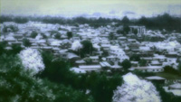


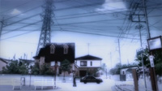


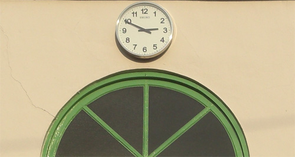


放学后的无所事事


放学时渚介绍自己家

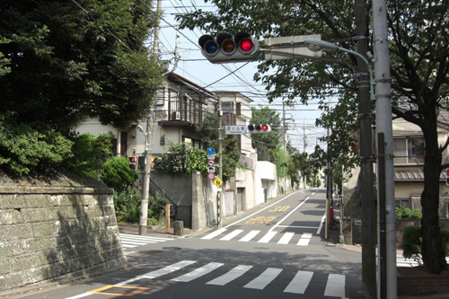


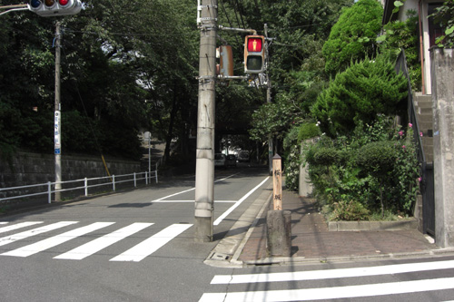


从渚家出来

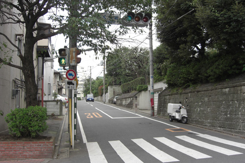
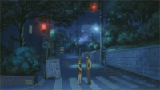


从家里逃出去


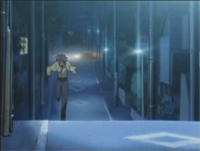

## 2. 最初的一步

- 渚练习演习

- 光世界中，少女独自拼接机器, 机器人愿意追随这个唯一的温暖

- 上学路上，杏遭遇事件（疑似对应第一集的椋的占卜）
- 智代表示看到朋也和渚让她怀念过去
- 介绍琴美，提到她是年级前十
- 中午，与古河渚讨论如何募集演习部部员
- 介绍幽灵女孩的传闻
- 为古河渚制作团子大家族，中途逃离父亲
  - 古河渚透露自己失落的原因是因为一直孤单一人
  - 朋也也透露因某些原因放弃了篮球
  - 古河渚提议陪朋也一起打篮球
- 下雨天，古河渚冒雨前来，为了报答一直依靠朋也的帮助
  - 古河渚想看朋也投篮，但朋也因与父亲打架导致右肩受伤
  - 古河渚因自卑和身体虚弱而生病

### Highlight 地点

早上和杏撞上


朋也出逃

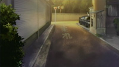
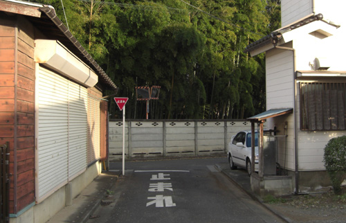

与渚谈心并建议篮球


## 3. 泪水之后再来一次

- 光世界中，追随温暖的机器人诞生了

- 朋也看望病倒的古河渚
- 介绍音乐人方野
- 智代第三次
- 中午一个人吃饭的古河渚, 朋也表示想哭可以依靠他, 不无聊
- 开始进入风子线, 归还小刀
- 介绍杏的小猪
- 介绍宫泽有纪宁
- 尝试练习复活演习部的介绍
  - 透露为什么喜欢演习, 因为一直向往与大家一起, 但可惜高中一直休学
- 可惜海报被学生会收回

### Highlight 地点

上学路上的放野

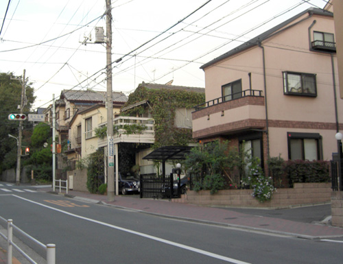
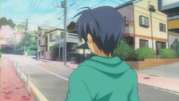

## 4. 寻找伙伴

- 朋也尝试帮助渚募集成员, 即使学生会阻止, 安慰渚
- 智代第4次
- 风子介绍姐姐结婚, 对象为方野, 希望朋也和大家现场祝贺
  - 所以才分发星星礼物
  - 风子姐姐以前时美术老师
- 智代透露自己想改变自己的形象 (更女生一些)
- 损招把椋叫来, 古河渚介绍演习部, 被误以为是女同表白
- 重新给椋和杏介绍了演习部复部,
- 智代第5次, 朋也出损招, 智代表示要竞选学生会长
- 朋也尝试邀请琴美去演习部
- 朋也邀请风子去演习部, 正式进入风子线
  - 风子本应该处于车祸在医院状态

### Highlight 地点

无

## 1-4集总结

- 基本上介绍各个人物+进入风子线
- 渚和朋也的互相治愈
- 以演习部为契机, 开启Galgame各个线

## 5. 雕刻的风景线

- 提议带风子直接见姐姐伊吹老师
- 探望伊吹老师
  - 无意中得知风子确实是伊吹妹妹, 但为什么伊吹在学校呢
  - 妹妹好像稍微好转, 第一个光玉出现在天上
- 在公园, 渚和朋也讨论风子, 以及为什么风子会雕刻
  - 决定帮助风子
  - 让风子住渚家, 很有可能从一开始父母就知道了是伊吹, 即使伪装姓名
- 风子刻了不少海星, 并分发出去
  - 包括认识的人
- 恶作剧风子
- 也有不愿接受的曾经的同学
- 风子透露自身情况, 开学之后只有一小段时间在学校, 之后一直在医院
- 为了帮助风子, 叫来大家为了风子扮演学校生活
  - 春原, 杏, 椋, 渚妈妈
  - 光玉出现

### Highlight 地点

前往伊吹老师家的路口

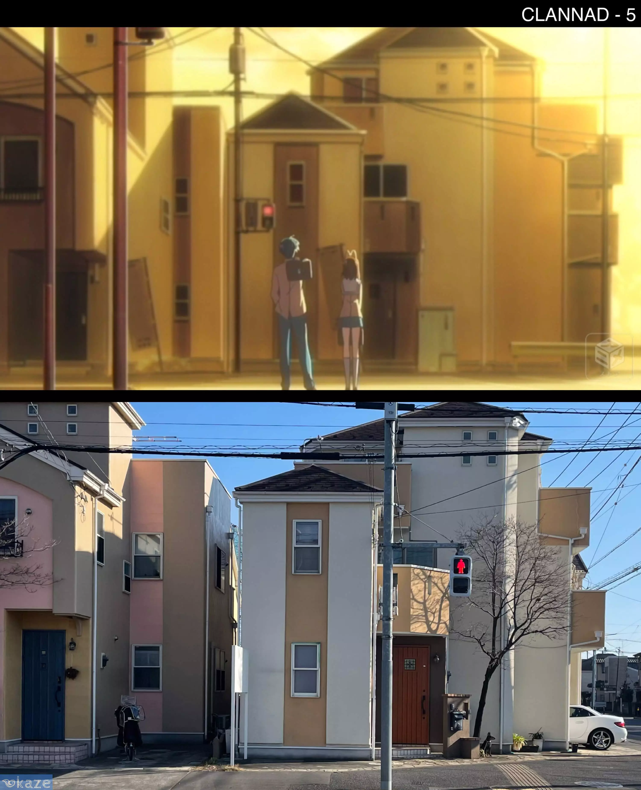

## 6. 姐妹的创立者祭

- 依旧是发海星, 但渚还是希望姐妹两人见面
- 春原来帮忙
- 准备叫上伊吹老师来创立者祭
  - 经过上次伊吹老师的玩笑+这次说感觉像风子父母, 两人感情发生变化
- 在创立者祭借着女仆餐厅更多地发海星
  - 渚也希望能像风子那样寻找演剧部成员
  - 打动了很多人包括之前拒绝的同学
- 伊吹老师看不见风子

### Highlight 地点

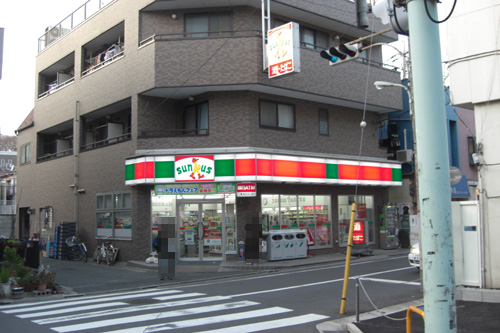


### 7. 星形的感情

- 伊吹老师希望朋也和渚一直陪风子到最后
  - 朋也和渚希望伊吹老师能为了风子的心意跟方野结婚
- 朋也和风子的吵闹日常
  - 代表着关系逐渐变好
- 在伊吹老师得知风子过去
  - 风子是个不爱说话的人
  - 伊吹老师曾试着通过自身冷淡促使风子在学校交朋友
  - 风子愿意尝试新学期交朋友, 但可惜回来路上出车祸
- 朋也和渚向兴村老师请求伊吹老师在学校的婚礼
- 医生说风子不会再醒来
- 春原透露大家开始渐渐看不见风子

### Highlight 地点


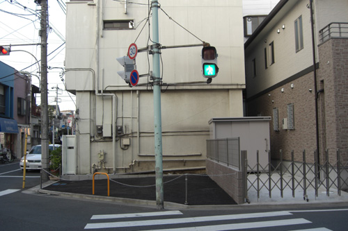


### 8. 消逝在黄昏的风

- 婚礼很快到了, 努力得到回报
- 虽然大家看不见了, 但风子和朋也的相声依然持续
- 大家逐渐看不见风子
- 春原也发现了风子的秘密, 打算去见医院的风子
  - 但是见完后就忘记风子了
- 亲近的人包括椋,杏也开始忘记
- 但是春原还残留感觉
- 在商店街, 朋也和渚给风子买礼物
- 来到喷泉花园, 朋也和风子变得坦率, 承认对方的好
- 渚父母也看不见, 即使妈妈还去医院确认过

### Highlight 地点


商店街


喷泉公园


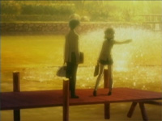

