# Clannad Season 1 Plot Highlight

## 注意事项

每看一集之前, 先去 <http://air.blue.coocan.jp/seichi-list.html#clannad> 打开当前一集快速查看一下主要圣地

看时, 记录关键剧情

如果剧情有圣地, 就用:

```
在<哪里>, <发生了什么>
```

格式,

最后看完时补充笔记

## 1. 在樱花飘舞的坡道上

- 在樱花坡道, 与古河渚第一次见面
- 介绍基友和宿舍
- 光世界, 简介, 机器人未出生
- 介绍椋与姐姐杏, 杏对朋也的明日上学路上的桃花运表示有意思
- 在学校广场，与古河渚一起吃午餐, 渚说明了留级情况, 朋也鼓励去演习部, 互相认识
- 介绍坂上智代
- 演习部废止, 朋也安慰渚, 被椋看见
- 街上和山头浪费光阴
- 放学时在人行横道, 渚介绍自己家
- 来古河面包房, 介绍父母和古河家庭
- 最后介绍朋也家庭情况, 和父亲和关系, 逃出家后遇见渚练习演习

### Highlight 地点

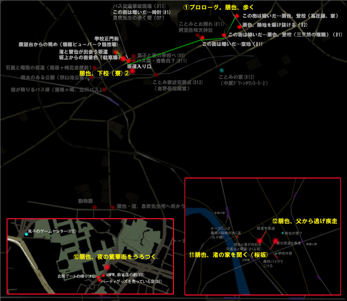

讨厌这个小镇

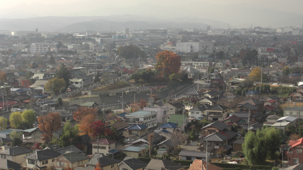
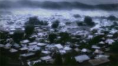

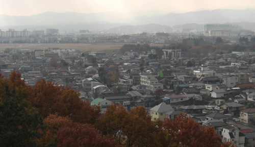


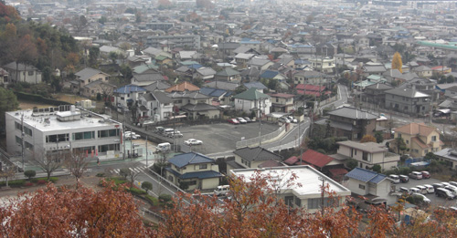
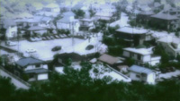


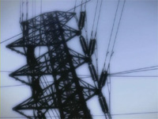


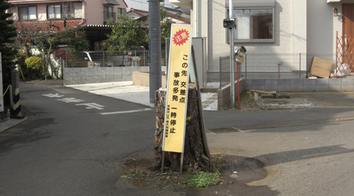
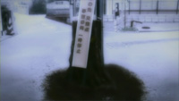

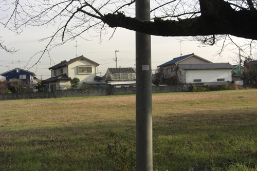
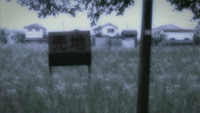


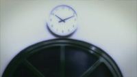

放学后的无所事事


放学时渚介绍自己家


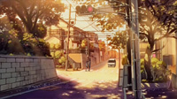


从渚家出来


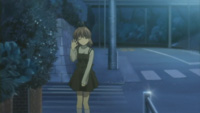

从家里逃出去

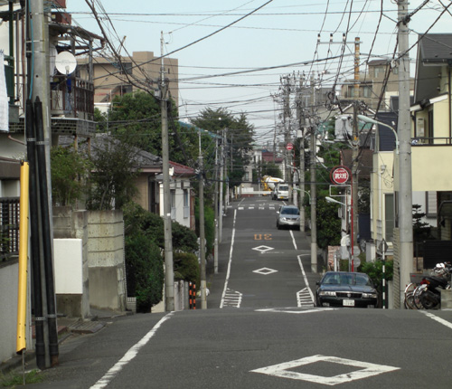


## 2. 最初的一步

- 渚练习演习

- 光世界中，少女独自拼接机器, 机器人愿意追随这个唯一的温暖

- 上学路上，杏遭遇事件（疑似对应第一集的椋的占卜）
- 智代表示看到朋也和渚让她怀念过去
- 介绍琴美，提到她是年级前十
- 中午，与古河渚讨论如何募集演习部部员
- 介绍幽灵女孩的传闻
- 为古河渚制作团子大家族，中途逃离父亲
  - 古河渚透露自己失落的原因是因为一直孤单一人
  - 朋也也透露因某些原因放弃了篮球
  - 古河渚提议陪朋也一起打篮球
- 下雨天，古河渚冒雨前来，为了报答一直依靠朋也的帮助
  - 古河渚想看朋也投篮，但朋也因与父亲打架导致右肩受伤
  - 古河渚因自卑和身体虚弱而生病

### Highlight 地点

早上和杏撞上

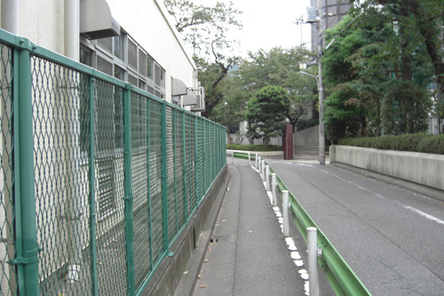
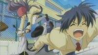

朋也出逃


与渚谈心并建议篮球

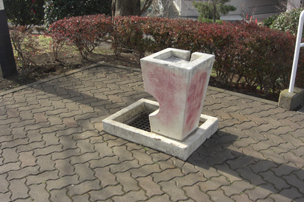
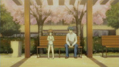

## 3. 泪水之后再来一次

- 光世界中，追随温暖的机器人诞生了

- 朋也看望病倒的古河渚
- 介绍音乐人方野
- 智代第三次
- 中午一个人吃饭的古河渚, 朋也表示想哭可以依靠他, 不无聊
- 开始进入风子线, 归还小刀
- 介绍杏的小猪
- 介绍宫泽有纪宁
- 尝试练习复活演习部的介绍
  - 透露为什么喜欢演习, 因为一直向往与大家一起, 但可惜高中一直休学
- 可惜海报被学生会收回

### Highlight 地点

上学路上的放野


## 4. 寻找伙伴

- 朋也尝试帮助渚募集成员, 即使学生会阻止, 安慰渚
- 智代第4次
- 风子介绍姐姐结婚, 对象为方野, 希望朋也和大家现场祝贺
  - 所以才分发星星礼物
  - 风子姐姐以前时美术老师
- 智代透露自己想改变自己的形象 (更女生一些)
- 损招把椋叫来, 古河渚介绍演习部, 被误以为是女同表白
- 重新给椋和杏介绍了演习部复部,
- 智代第5次, 朋也出损招, 智代表示要竞选学生会长
- 朋也尝试邀请琴美去演习部
- 朋也邀请风子去演习部, 正式进入风子线
  - 风子本应该处于车祸在医院状态

### Highlight 地点

无

## 1-4集总结

- 基本上介绍各个人物+进入风子线
- 渚和朋也的互相治愈
- 以演习部为契机, 开启Galgame各个线

## 5. 雕刻的风景线

- 提议带风子直接见姐姐伊吹老师
- 探望伊吹老师
  - 无意中得知风子确实是伊吹妹妹, 但为什么伊吹在学校呢
  - 妹妹好像稍微好转, 第一个光玉出现在天上
- 在公园, 渚和朋也讨论风子, 以及为什么风子会雕刻
  - 决定帮助风子
  - 让风子住渚家, 很有可能从一开始父母就知道了是伊吹, 即使伪装姓名
- 风子刻了不少海星, 并分发出去
  - 包括认识的人
- 恶作剧风子
- 也有不愿接受的曾经的同学
- 风子透露自身情况, 开学之后只有一小段时间在学校, 之后一直在医院
- 为了帮助风子, 叫来大家为了风子扮演学校生活
  - 春原, 杏, 椋, 渚妈妈
  - 光玉出现

### Highlight 地点

前往伊吹老师家的路口


## 6. 姐妹的创立者祭

- 依旧是发海星, 但渚还是希望姐妹两人见面
- 春原来帮忙
- 准备叫上伊吹老师来创立者祭
  - 经过上次伊吹老师的玩笑+这次说感觉像风子父母, 两人感情发生变化
- 在创立者祭借着女仆餐厅更多地发海星
  - 渚也希望能像风子那样寻找演剧部成员
  - 打动了很多人包括之前拒绝的同学
- 伊吹老师看不见风子

### Highlight 地点


### 7. 星形的感情

- 伊吹老师希望朋也和渚一直陪风子到最后
  - 朋也和渚希望伊吹老师能为了风子的心意跟方野结婚
- 朋也和风子的吵闹日常
  - 代表着关系逐渐变好
- 在伊吹老师得知风子过去
  - 风子是个不爱说话的人
  - 伊吹老师曾试着通过自身冷淡促使风子在学校交朋友
  - 风子愿意尝试新学期交朋友, 但可惜回来路上出车祸
- 朋也和渚向兴村老师请求伊吹老师在学校的婚礼
- 医生说风子不会再醒来
- 春原透露大家开始渐渐看不见风子

### Highlight 地点


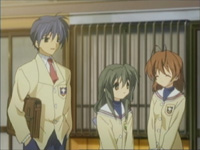

### 8. 消逝在黄昏的风

- 婚礼很快到了, 努力得到回报
- 虽然大家看不见了, 但风子和朋也的相声依然持续
- 大家逐渐看不见风子
- 春原也发现了风子的秘密, 打算去见医院的风子
  - 但是见完后就忘记风子了
- 亲近的人包括椋,杏也开始忘记
- 但是春原还残留感觉
- 在商店街, 朋也和渚给风子买礼物
- 来到喷泉花园, 朋也和风子变得坦率, 承认对方的好
  - 风子看见朋也和渚, 开始萌生希望他们关系变得更好的想法
- 渚父母也看不见, 即使妈妈还去医院确认过
  - 因此无法居住渚家决定去学校过夜

### Highlight 地点

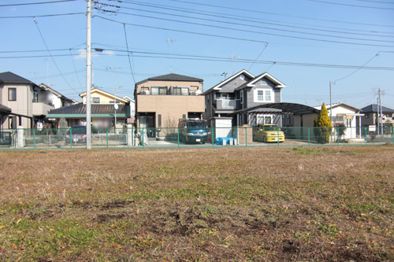


商店街


喷泉公园


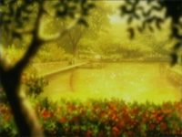


详看第11话地点


### 9. 直到梦的最后

- 朋也和风子的打闹日常
- 风子希望朋也和渚直接叫名字, 希望他们像姐姐和方野一样
- 提前祝贺了伊吹老师和方野的婚礼
- 在睡着之后第二天, 连古河渚和朋也也忘了风子
  - 但还有海星和微弱的记忆
- 努力回想起了风子, 再次见到风子
  - (感动点)
- 结婚仪式到了, 三人手牵手一直在一起, 
- 学生们虽然忘记了风子, 但看见海星后都想起来了婚礼并到现场
- 风子说的那场梦: 海星祭, 其实每天都是海星祭, 过的很开心
  - 再次不见
  - (感动点)
  - 向伊吹老师暗示了幽灵妹妹的努力, 并祝福
- 风子出现在姐姐面前
  - (感动点)
  - 风子祝福, 传达到了
- 虽然风子不见了, 但大家对风子的印象不减

### Highlight 地点

这是之前几集出现的风子路口


樱花道往外看

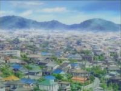

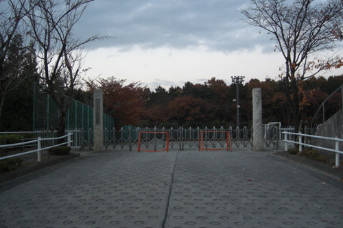


## 4-9集风子线总结

TODO

## 10. 天才少女的挑战

- 光世界, 好奇这些光是什么
  - 请注意此时, 风子的光玉已获得
  - 是影子, 是每个"\[平凡\]的景色"影子呢

- 渚和朋也一起上学
  - 再次撞见杏
- 拉琴美进演剧部, 正式开始琴美线
  - 琴美和古河渚以奇怪的对话相识
- 送琴美回家
  - 琴美表示怕生, 但对朋也和渚表示还行
- 和琴美去书店买书
  - 朋也看到减书行为表示需要帮琴美多认识人
- 带琴美去认识杏
  - 杏表示自己和妹妹的对手增加了
  - 也成为了琴美的朋友
- 带琴美去认识椋
  - 椋占扑无法交到朋友, 但椋成为朋友
- 带琴美认识智代
- 通过小卖部阿姨得知琴美父母是知名学者
- 杏借助和琴美搞好关系的契机为自己和椋制造跟朋也搞好关系的机会, 但朋也把她们带到了演剧部
  - 但也让所有人互相认识
- 琴美被小提琴吸引, 拉出尖叫声
- 一位神秘人登场

### Highlight 地点

椋下车车站

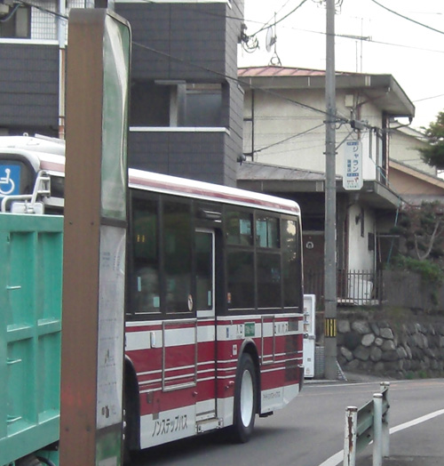


朋也和渚的上学路

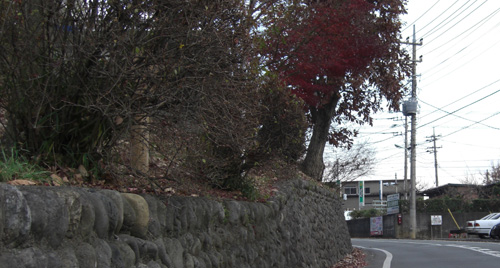
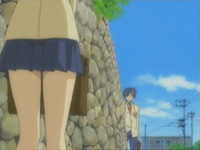

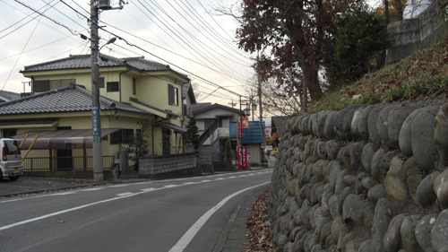
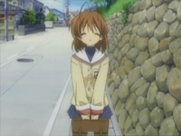


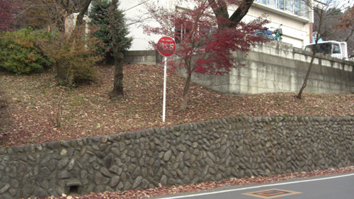


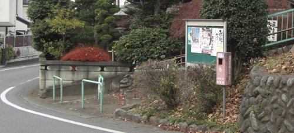
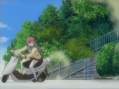

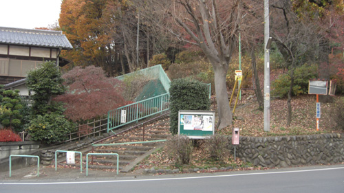


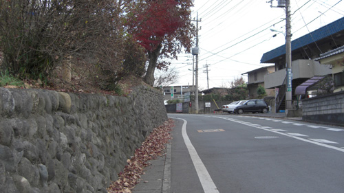


朋也送琴美回家


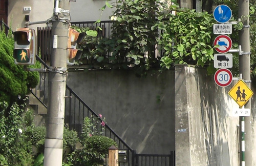
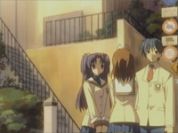

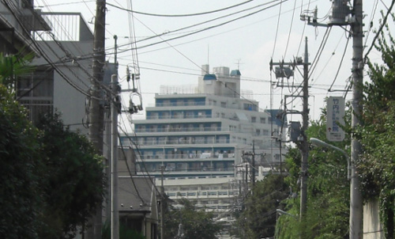
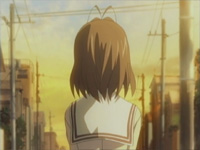


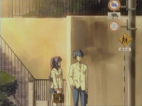

有一个书店的地点, 但觉得地点牵强, 不大像


## 11. 放学后的狂妄曲

- 琴美用小提琴与大家打招呼
- 放学后在演剧部, 琴美尝试吐槽
  - 大家以及打好关系
- 杏想把琴美从朋也支走iu, 创造两人环境
- 杏与朋也在公园
  - 杏的暗示告白, 也是为妹妹着想
- 琴美周日也在, 朋也听到了小提琴也去
  - 一起吃了琴美自制的苹果派
  - ["前天看到了小兔，昨天是小鹿，今天是你"](https://zh.moegirl.org.cn/zh-hans/%E5%89%8D%E5%A4%A9%E7%9C%8B%E5%88%B0%E4%BA%86%E5%B0%8F%E5%85%94%EF%BC%8C%E6%98%A8%E5%A4%A9%E6%98%AF%E5%B0%8F%E9%B9%BF%EF%BC%8C%E4%BB%8A%E5%A4%A9%E6%98%AF%E4%BD%A0)
  - 琴美想两个人一起看书
  - 朋也做了奇怪的梦, 梦见什么精神分裂
- 在神社⛩面前分别, 琴美表示朋能来感到开心
- 琴美的小提琴会
  - 智代遇见佐枝, 佐枝是曾经的传奇学生会长, 智代想要请教
  - 也算是帮助琴美克服怕生
- 放学后, 遇到琴美的坏人
  - 朋也听到杏和椋谈论起琴美是情敌

### Highlight 地点

放学后的暗示表白地点


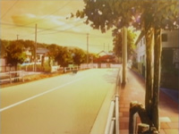

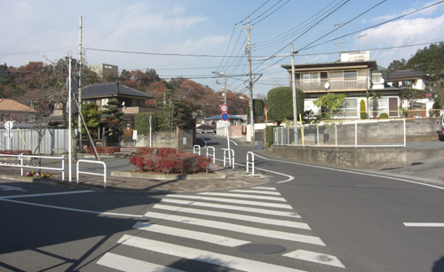


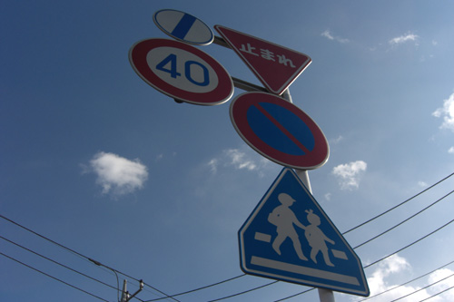
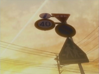

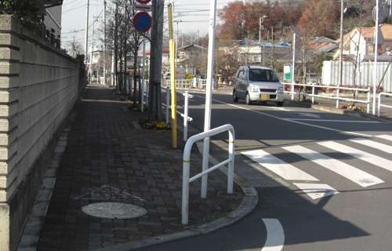


周日朋也出门


朋也与琴美周末图书馆后回家分别处的神社⛩


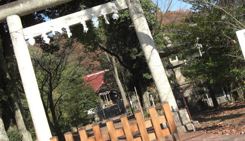
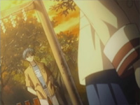

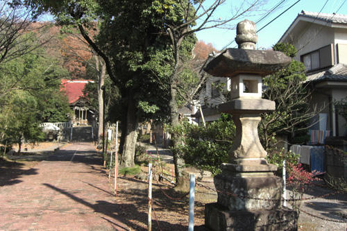
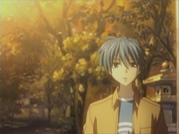


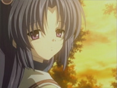

以及樱花道, 详见common place

## 12. 被隐藏的世界

- 琴美归还了小提琴
  - 朋友逐渐增多, 为此感到高兴而流泪
- 琴美开始去教室听课
- 也跟演剧部的大家关系更好, 还做了便当🍱
- 周末一起是商店街
  - 大家决定一起为下周6生日的琴美送礼物
- 娃娃机抓礼物, 真风子出现, 大家已无印象但感觉见过
  - 虽然没拿到
  - 琴美有心事
- 在两人回家路上, 琴美希望朋也拿着这本书就好, 即使不读
- 大叔再次出现, 朋也带着甩开
- 朋也梦见小时候的梦
- 早上琴美胸袭, bus翻车事件
  - 琴美恐慌, 另有隐情
- 渚, 朋也, 椋, 杏, 决定去琴美家看望
  - 黑色的蝴蝶
  - 朋也在意那个房子, 返回去了
- 朋也遇到了大叔, 以前同为研究员, 朋也得知了琴美的父母的秘密
  - 父母是发现了宇宙形成过程中脱落下来的\[隐藏的世界\], 但因(可能是政治原因)而..
- 大叔希望朋也转告给琴美, 朋也前去琴美家
  - 也发现了琴美父母因飞机事故去世
  - 朋也想起以前与琴美见过

### Highlight 地点

商店街


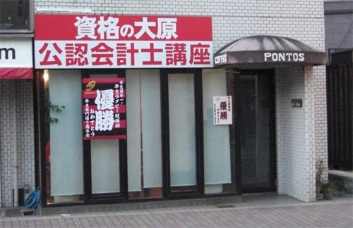


分别路上


朋也和琴美回家路上


车祸现场


琴美家(有可能找不到)(有可能在CLANNAD DVD 3 表纸附近)


大家返回后朋也决定再次返回


与黑衣大叔交谈


