# Clannad 常见地点

## 朋也家

所有朋也家认准这张

请注意这个房子早已不复存在, 只有前面的电线杆, 和背景的4楼房子还match

第1集

第17集

第19集

AF第19集

## 樱花坡道

第1集

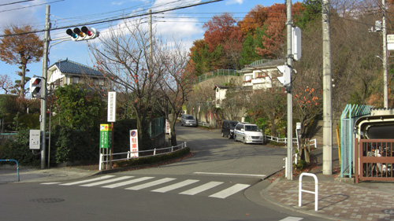

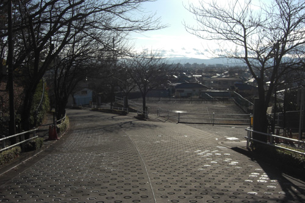

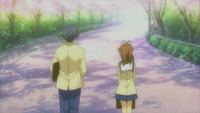

第2集

第6集

第8集

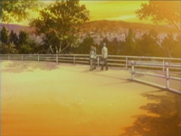
 (如何取景的, 详见第18集说明)

第11集

同时OP中芳野和伊吹出现的地方

第12集

第15集

第16集

第17集

第18集

在坡道往外走一个小坡上

 (这张图解释了第8集, 和风子一起放学的那个场景是怎么取景的)
 (不过事实上, 动漫里这块的角度跟人认为应该是上图的对面角度)

第19集

第22集

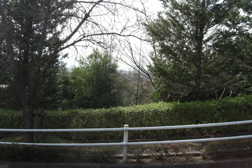

### AF

AF第1集

消防点前面的电线杆

AF第4集

AF第5集

AF第7集

AF第9集

AF第13集

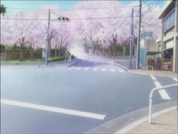

AF第22集

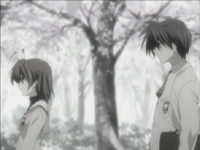

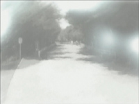

## 学校门口

认准这一张

第1集

第14集

第22集

AF第5集

AF第11集

## 学校大楼正面 （TODO）

无需进入学校内部即可拍摄的

第13集

第15集

## 春原宿舍

所有春原宿舍认准这个图

实际上到今天地图上已经完全看不出来

第1集

第3集

第16集

 (为宿舍正门对面的居民楼, 截止至收集时间还在)

第17集

AF第5集

## さくら板 (TODO)

第1集

第10集

第17集

第19集

 (此为さくら板北面的桥, AF第5集会有更多说明)

AF第2集

AF第5集

(桥上)

 (通过占位和桥旁边的房子可以判断, 这一段需要从南往北拍, 也就是从さくら板十字路口往桥方向拍)

## 古河渚家与公园 (かめのこ児童公園)

所有古河渚面包店图认准这个图
来自[kaze的不務正業ACG. 博客](https://aurakaze.blog/clannad-jyunrei3/#toc4)

第1集

第5集

第17集

第19集

第20集

野餐去家门口

使用以下Google地图对照

AF第2集

(对着房子拍)

AF第3集

AF第10集

另一侧

AF第13集

AF第14集

 (大概率拍不到这个角度)

AF第19集

AF第22集

## 电车站 (羽村駅)

第1集

第8集

第12集

第16集

第18集

AF第2集

AF第11集

AF第17集

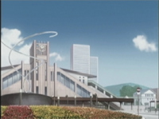

## 风子十字路口

上面的演碟本店就是最大的特征, 即使十字路口的其他建筑都变了

第6集

第7集

第9集

第19集

 左侧一角的商店一致

第21集

AF第3集

## 峡山池喷泉公园 (TODO)

第8集

第12集

AF第5集

AF第6集

 (这个角度跟第一季第8集风子他们第一次去这个公园是一个角度)

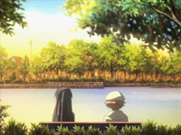 (这角度对吗)

AF第22集

## 早稻田商店街 (TODO)

第1集

第8集

 （左边的就是，至于原因见下面第12集）

第12集

 (POTON小屋顶已经不见了, 但会计师培训楼还是会计师培训楼，这里同样也是第8集和风子一起去的小饰品摊)

第18集

 与风子的第12集一致

第22集

AF第3集

春原与早苗的假装约会

朋也带着芽衣出去玩时

 (感觉这个游戏厅可能不存在)

## どんぐり山児童公園

AF第3集

 (方位有点off， 是因为秋千真实是斜着摆的)

AF第13集

(朋也练习棒球的一幕)

(求婚决战)

AF第22集

## 河道 - 八幡市木津川

一旦涨水就不能下去

AF第8集 - 决战之日

(搜寻时以铁塔为锚点)
(同时注意剧中东西方向在现实中相反)
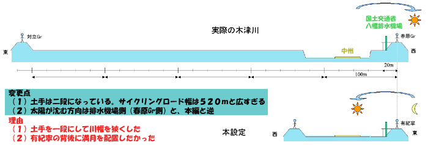

晚上

 (为了让月亮出现在有纪宁这一侧, 所以剧中东西方向相反)

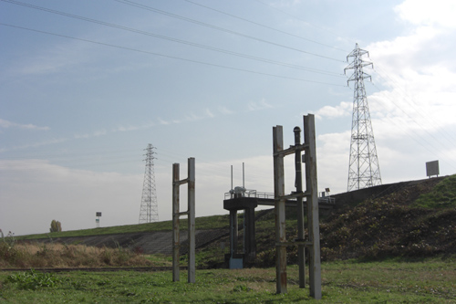 (此处伸出来的也是CLANNAD AF DVD封面之一)

AF第14集

AF第15集

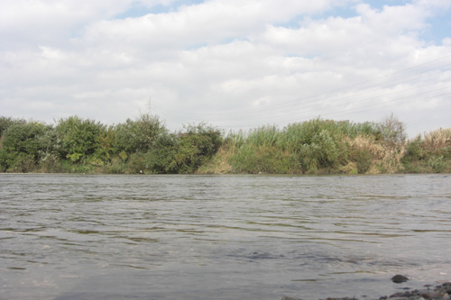

## 朋也新家

吹田市千里山, 依然我们没法公开地址, 但是

 (现实生活中对面不是河岸, 相反是一个立交桥)

 (认准这张图里的左边黄色屋顶アパート)

下面是来自[お箸が重い](http://air.blue.coocan.jp/cla-af-10.html)的CLANNAD AF 第10集方位图

AF第10集

AF第16集

AF第17集

AF第20集

 （注意停车场现在已经盖楼了

AF第21集（病危的汐）

 （对应这栋老房子，目前依然在）

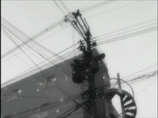

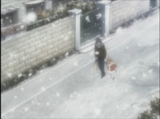

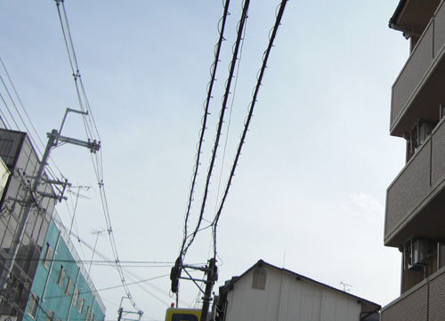

## 朋也新家附近

### Pattern 1 - 弯道 - 吹田市道山手町14号線

认准这三张， 分别为弯道上中下

AF第10集

AF第11集

 

 
AF第12集

 (从弯道下方开始)

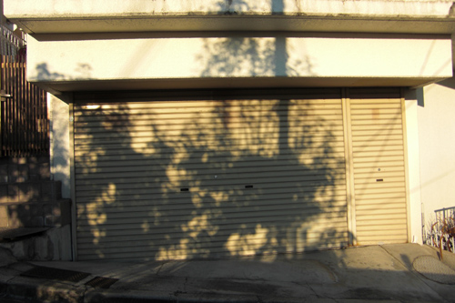

AF第15集

(有此地地点其他方位的, 但可惜已经面目全非)

比如

现在已经是

AF第20集

### Pattern 2 - 一段上下坡

认准这张

请注意图中左边的石堆已经变成房子了

AF第10集

AF第12集

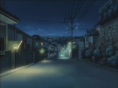

AF第16集

AF第17集

