# Clannad After Story (Season 2) Episode 1 Plot Highlight

第一集主要先是介绍上一季已经拧在一起的圈子,
并预告接下来要走哪些线

## 1. 夏末的离别

- 朋也思考着 小时候, 朋也父亲曾带着朋也去过花田

- 秋生父亲让朋也去从演剧部里找伙伴来练习棒球, 击败隔壁商店街队

- 第7颗光玉出现 (表白后成为男女朋友也算?)

- 朋也召集伙伴
  - 也介绍并召集方野, 美佐枝
  - 渚尝试叫上朋也父亲, 但朋也还是介意
- 比赛开始
  - 每个人都有特色, 方野, 智代, 杏, 渚, 朋也, 春原
  - 朋也最后的全垒, 代表着小镇

### Highlight 地点

common 樱花坡道

桥

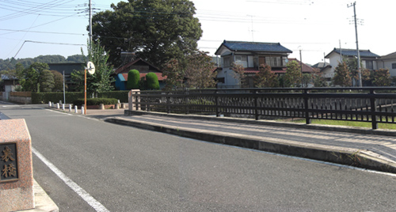
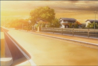

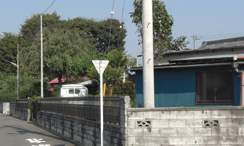
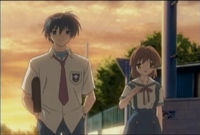

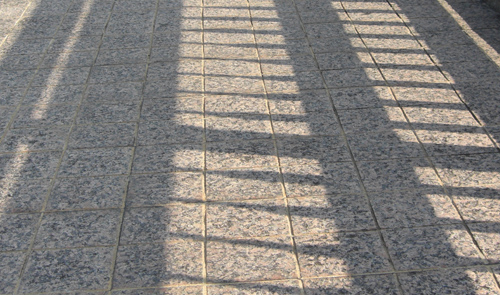
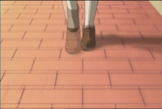

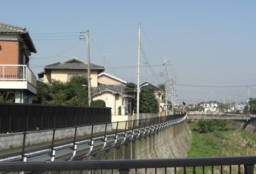
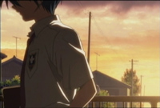

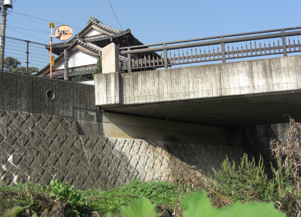
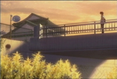

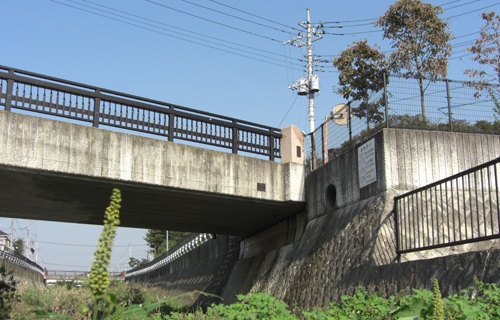
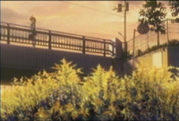

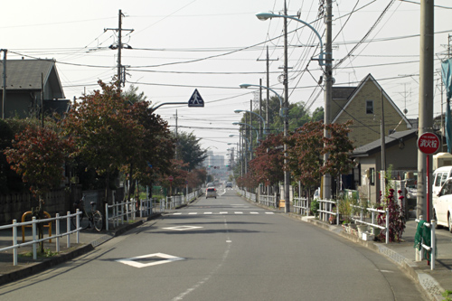
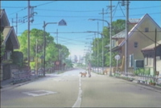

武蔵村山、総合体育館の球場 (AF DVD 1 表纸也在这里)

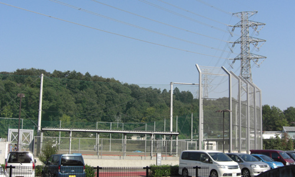
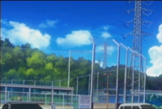

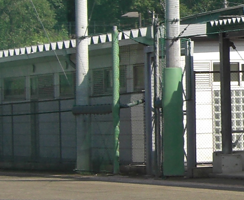
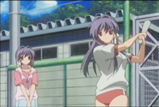

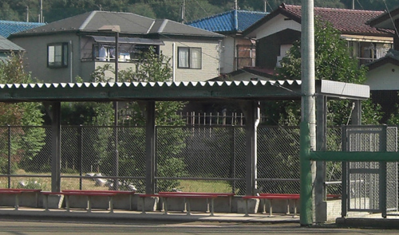
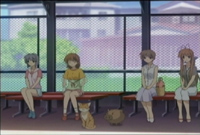

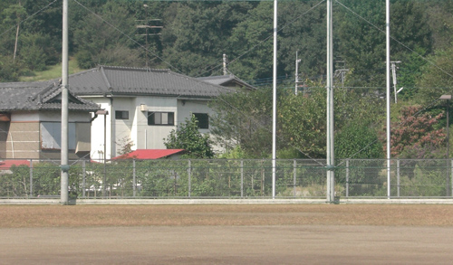
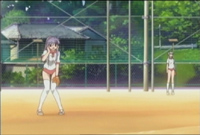

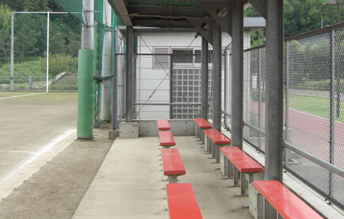
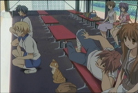

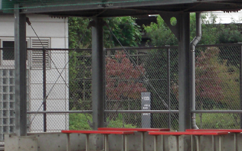
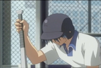

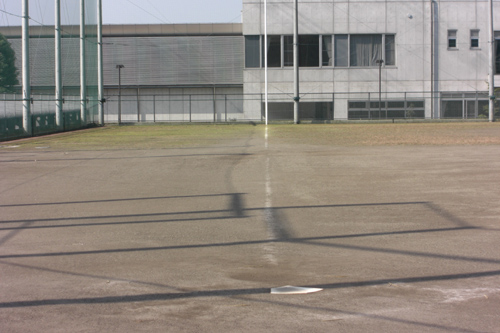
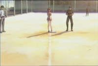

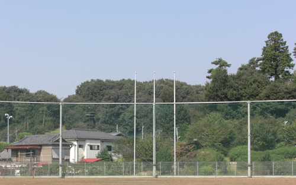
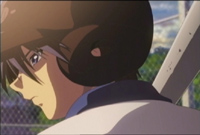

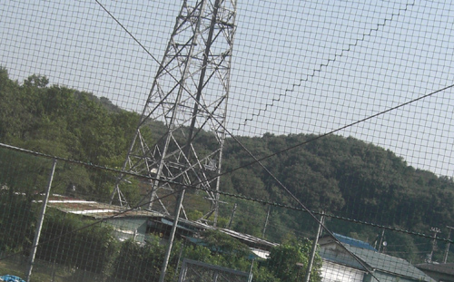
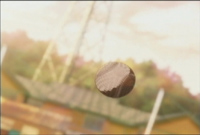

