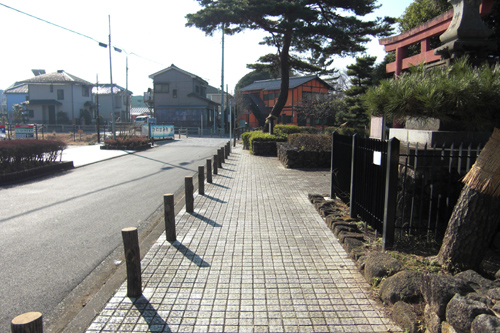
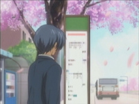
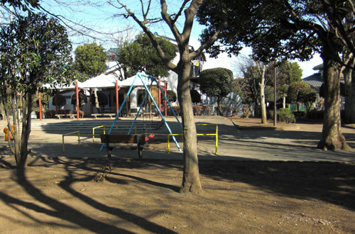

# Clannad After Story (Season 2) Episode 12 Plot Highlight

12集有芳野线, 同时也是转折点, 开启结婚

## 12. 

- 朋也工作稳定下来了

- 秋生希望跟女儿渚一起玩
  - 让渚在意起了朋也和父亲的关系, 渚希望朋也跟父亲见一见
  - 朋也依然表示不见

- 一次工作路上, 芳野讲起往事
- 芳野以前也是不良少年, 赶上乐队潮拿起来吉他
- 伊吹老师赞美芳野的情歌
- 芳野打算毕业走音乐路
  - 老师答应芳野成为pro之后与他交往
- 出道后, 一直忘我唱歌, 即使时不时唱丑陋的曲
  - 也依然火, 因为打动了那些处在逆境的歌迷
- 看到不幸的孩子们以他的歌为寄托后, 芳野意识到自己不再是为自己写歌
  - 意识到需要为大家写歌, 变得无法写歌
- 再次开始写歌只是为了拯救, 但都是一些飘渺的梦想和不切实际的东西
- 最后歌变成了对现实的绝望吼叫, 并染上吸毒
- 等回到小镇之后, 再次看到伊吹老师
  - 想起本应该一直为伊吹老师唱情歌
- 最后芳野告诫朋也, 不要忘记最重要的东西
  - 也就是渚

- 朋也父亲疑似犯事, 导致原本老板的推荐也黄了
- 朋也想要带着渚逃出这个小镇, 但渚不同意
  - 渚认为不能逃避, 同时也喜欢这个小镇
  - 朋也一不小心对渚不同意这件事喊了起来
- 朋也与渚到看守所见父亲, 朋也对父亲一句话都不说感到生气, 对父亲的憎恨到了极点
  - 在外面发气, 故意赌气
  - 渚的阻拦让朋也意识到渚, 感到无望的朋也向渚求婚

### Highlight 地点

common 朋也新家附近

峡山池公园外围的路

 (也是AF DVD 4表纸)

松原西公園

看守说

回来路上和求婚

