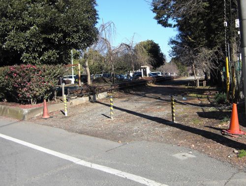
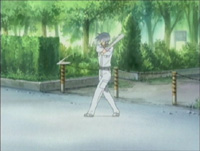
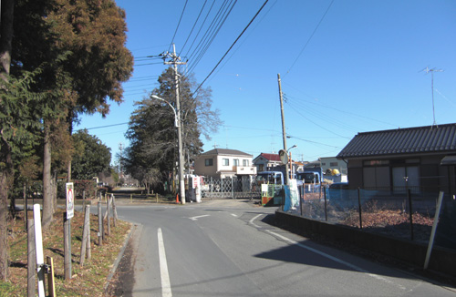
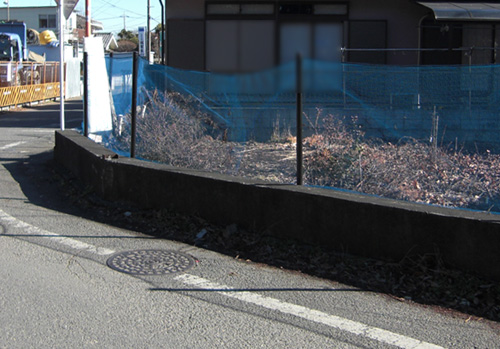
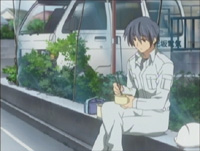

# Clannad After Story (Season 2) Episode 13 Plot Highlight

## 13. 毕业

- 朋也来到古河渚家, 来请求渚父母同意结婚
  - 也谈论到朋也父亲
  - 渚和早苗先出去了, 留下朋也和秋生
  - 秋生感觉到了, 决定于朋也棒球决斗

- 第11个光玉(谁的?)

- 朋也完败秋生的棒球, 自责中早苗鼓励
- 朋也练习, 但依旧完败, 被秋生嘲笑说还是个孩子无法保护渚
  - 朋也说技术不足就用热情弥补, 更加练习
- 最终热情打动秋生再给最后一次机会, 打出本垒并请求父母成功

- 圣诞节, 渚和朋也一起过
  - 家里圣诞聚餐, 渚第一次喝酒
- 当早苗问道幸福时, 朋也一时愣了一下, 可能是在意父亲的事

- 渚冬天又病倒, 但可以顺利毕业了
  - 为了庆祝毕业, 朋也叫来所有同学, 包括以前的老师
  - 一起举行渚的毕业仪式
  - 渚同时也决定要变得坚强起来

- 朋也与渚再次见朋也父亲, 告知准备结婚了
- 结婚后, 渚名为冈崎渚

### Highlight 地点

common どんぐり山児童公園

另一处练习的一幕

common 古河渚公园

common 樱花道

## 14. 新的家族

- 朋也与秋生互认父子

- 朋也和渚开始新婚生活
  - 一时还期待过, 落空了
- 渚也要开始找工作
  - 两人决定要永远在一起, 能克服任何困难
- 渚找到了女仆咖啡厅服务员工作
- 朋也再次提到光玉的传说, 说到愿望, 渚希望生个宝宝

- 朋也和秋生去看渚工作的样子
  - 来到了咖啡厅, 意识到原本的上学路没了, 被改建为咖啡厅
- 在咖啡厅, 遇见了仁科同学她们, 也看见了渚穿制服的样子
  - 有人骚扰渚, 被朋也和秋生打回去了
  - 朋也被咖啡厅经理叫去谈话, 描述了渚工作的优缺点, 希望朋也平时多照顾
- 晚上回家后, 渚说起旧学校会被拆除, 想到记忆被慢慢抹去, 突然生气
  - 自己也不知道为什么会对小镇不断改变而感到不安

- 最后, 渚怀孕

### Highlight 地点

common 八幡市木津川
