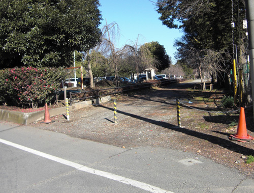

# Clannad After Story (Season 2) Episode 13 - 16 Plot Highlight

包含求婚到生渚的过程

## 13. 毕业

- 朋也来到古河渚家, 来请求渚父母同意结婚
  - 也谈论到朋也父亲
  - 渚和早苗先出去了, 留下朋也和秋生
  - 秋生感觉到了, 决定于朋也棒球决斗

- 第11个光玉(谁的?)

- 朋也完败秋生的棒球, 自责中早苗鼓励
- 朋也练习, 但依旧完败, 被秋生嘲笑说还是个孩子无法保护渚
  - 朋也说技术不足就用热情弥补, 更加练习
- 最终热情打动秋生再给最后一次机会, 打出本垒并请求父母成功

- 圣诞节, 渚和朋也一起过
  - 家里圣诞聚餐, 渚第一次喝酒
- 当早苗问道幸福时, 朋也一时愣了一下, 可能是在意父亲的事

- 渚冬天又病倒, 但可以顺利毕业了
  - 为了庆祝毕业, 朋也叫来所有同学, 包括以前的老师
  - 一起举行渚的毕业仪式
  - 渚同时也决定要变得坚强起来

- 朋也与渚再次见朋也父亲, 告知准备结婚了
- 结婚后, 渚名为冈崎渚

### Highlight 地点

common どんぐり山児童公園

另一处练习的一幕

common 古河渚公园

common 樱花道

## 14. 新的家族

- 朋也与秋生互认父子

- 朋也和渚开始新婚生活
  - 一时还期待过, 落空了
- 渚也要开始找工作
  - 两人决定要永远在一起, 能克服任何困难
- 渚找到了女仆咖啡厅服务员工作
- 朋也再次提到光玉的传说, 说到愿望, 渚希望生个宝宝

- 朋也和秋生去看渚工作的样子
  - 来到了咖啡厅, 意识到原本的上学路没了, 被改建为咖啡厅
- 在咖啡厅, 遇见了仁科同学她们, 也看见了渚穿制服的样子
  - 有人骚扰渚, 被朋也和秋生打回去了
  - 朋也被咖啡厅经理叫去谈话, 描述了渚工作的优缺点, 希望朋也平时多照顾
- 晚上回家后, 渚说起旧学校会被拆除, 想到记忆被慢慢抹去, 突然生气
  - 自己也不知道为什么会对小镇不断改变而感到不安

- 最后, 渚怀孕

### Highlight 地点

common 八幡市木津川

## 15.

- 渚决定要生下来, 秋生希望朋也更可靠点
  - 毕竟朋也需要支撑起一家三口的开销
  - 也稍微在思考父亲当时生朋也时是怎么样的
  - 朋也感觉没有现实感
- 渚孕妇反应加多, 只能躺着, 朋也照顾着
- 十周后好了, 之后渚决定自家分娩
  - 但家人们还是担心困难, 渚的身体
  - 不过助产士说过需要relax环境, 因此大家都像渚隐瞒身体状况的讨论
- 渚希望即使出意外也要生出来
- 而朋也的安慰并不能把紧张的环境散去
- 突然渚晕倒, 紧张, 担心的气氛
- 早苗告知朋也, 医生说目前渚的情况, 分娩有危险, 可能有万一
- 需要尽早考虑要不要放弃, 但渚打算生下来
  - 即使朋也更加着急, 担心
- 渚虽然开朗, 但其实也很担心
- 秋生带朋也来到一个秘密花园
  - 那时渚生重病时, 秋生抱着渚无意间到了那里, 祈祷能拯救渚
  - 渚真的睁开了眼睛
  - 秋生把这个地方当作渚的分身, 然而这个地方目前正在建医院
  - 秋生预感, 接下来会更加困难, 需要相互维持
- 渚和朋也来到河边, 为孩子取名汐, 寓意大海的涨落潮
- 朋也希望渚发誓, 明年三人一起看海, 但朋也和渚都担心明年可能不行了

### Highlight 地点

common さくら板

common 朋也新家附近

common 八幡市木津川

## 16. 白色黑暗

- 光世界, 机器人执意要去收集垃圾，只为了能与少女永远在一起

- 第12个光玉出现(出生算一个？汐的应该在后面吧)

- 大家坐着力所能及的事
- 一次与早苗回家路上，朋也开始自负起来，认为是遇到自己让渚受罪，对自己和渚过去以来的相互维持起了怀疑
  - 即使早苗安慰，也开始考虑如果渚没有遇见自己该多好

- 光世界，机器人仍在一人搭建着飞机

- 圣诞节，又增加了一个团子
- 新年，杏，椋，春原，琴美来看望
  - 还有仁科，智代，有纪宁的贺纸
- 春原问住了朋也，当父亲是什么感觉，但朋也没有实感，只是敷衍过去了
  - 大家没有变
- 琴美提到自己继续起父母的研究（被隐藏的世界，也是关于光世界，很重要）
  - 当前世界是更高维度世界的贴膜（想象一下二次元对于三次元的关系，二次元界也无法理解三次元界）
  - 但是如重力，人的意识，时间空间，会相互作用，时而重塑两个世界，时而诞生新的世界
  - （请注意这里提到人的意识可以重塑世界或新创世界，对应CLANNAD AF后期的剧情）
  - 朋也一瞬，疑似看到光世界
  - 椋的占扑也说过选择分支与不同的世界

- 光世界，机器人无法像少女那样拼起废品，最终自身也停止工作

- 朋也再次来到正在建医院的渚的分身地，说讨厌起了小镇，希望能保住渚的分身地
  - 但医院对所有人都是好事，而且智代也帮忙说留下几棵树

- 在下大雪的一天，渚提早两周分娩
  - 但也去世
- 第一集樱花坡道的场景再现，朋也心想如果没有遇见渚该多好

### Highlight 地点

関西大学前横の道

(背景已经完全不像了，只剩栏杆和电线杆)

六地蔵総合病院

## 13-16集大概

重点在于渚的去世，以及看到渚受苦时朋也的动摇，对过去从遇见渚，两人互相扶持到现在的一切都开始动摇起来，而这份动摇很有可能与过去跟父亲有关系

