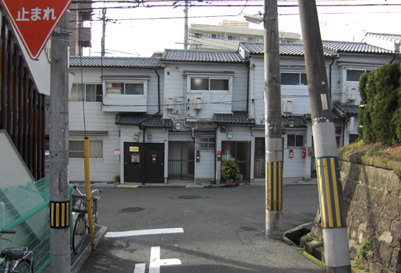
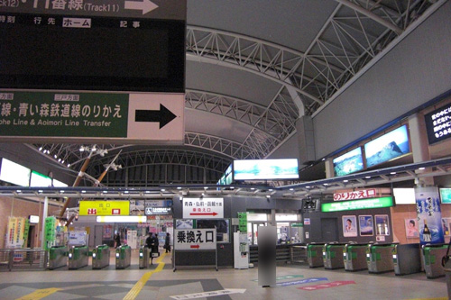
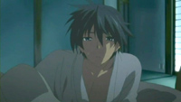
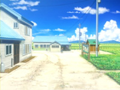
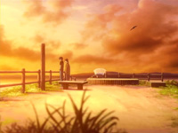
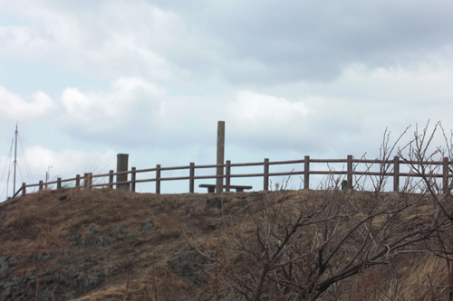
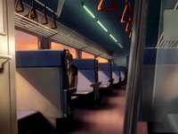

# Clannad After Story (Season 2) Episode 17 - 19 Plot Highlight

关于汐的线, 全Clannad最感动的一条线，Clannad的精华

## 17. 夏时间

- 渚去世后的5年时间，朋也过着麻木的生活，如同行尸走肉，把汐寄托给早苗家
  - 想要忘记一切，对与渚的回忆是错的

- 光世界，机器人认识到自己不是人类，做不到把废品拼成飞机
  - 少女找到机器人，安慰机器人

- 早苗拜访一人的朋也
  - 安慰着朋也，把朋也叫出来，同时交代了带上汐出去旅游的事
- 朋也原本想等待早苗秋生再去
  - 在等待中和汐逐渐熟悉，购物，吃饭
  - 最后两人决定前去旅游

### Highlight 地点

（与第一话一样）

common 朋也新家

common 电车站

common 早稲田商店街

common 朋也新家附近

## 18. 

- 光世界，机器人和少女打算走着去（即使少女即将沉睡）

- 火车上，朋也对领座的一次发火，不小心惹哭了汐
  - 汐被教育不能随便哭，但朋也想到自己的经历，告诉汐在爸爸这可以哭
- 换乘站，朋也买了个机器人玩具（有寓意吗？对应光世界的机器人？）

- 在公寓，朋也关心着自己的女儿，陪汐上厕所，看萤火虫
- 汐想妈妈了，希望朋也讲讲妈妈渚的事
  - 但朋也不想讲
- 下车后，来到一片油菜花田，两人一同惊叹，朋也让汐自由自在的玩
- 汐不小心弄丢机器人，在寻找的画面让朋也突然想起来
  - 朋也还小的时候，爸爸陪着自己的回忆

- 朋也让汐自己呆在原地，追寻记忆，来到一处海岸线，见到自己的奶奶
- 奶奶讲起朋也爸爸的事，情景与朋也现状很像
  - 在朋也妈妈去世后，朋也爸爸不屈服，振作起来愿意为了孩子而奋斗
  - 但长时间工作的压力开始酗酒
  - 朋也想起来了一切，理解了爸爸，也意识到自己把汐推给早苗家这个行为连爸爸都不如
  - 也让朋也转达给爸爸是时候可以休息了让他回家

- 朋也和奶奶回到油菜花田
  - 汐说机器人是爸爸买的第一个礼物，弄丢了，能哭的地方除了厕所就是爸爸的怀里
  - 朋也为自己不是个称职的爸爸感到愧疚，希望今后能一直陪在汐身边

- 回家路上，朋也主动给汐讲起妈妈渚的事
  - 直到今天为止才想到，自己一直以来的自负都是错的，虽然渚不在了，但汐还在

### Highlight 地点

E２系-１０００番台 東北新幹線

八戸駅

４８５系３０００番台

住宿宾馆（宇治市 亀石楼）

陸奥横浜駅

竜飛岬（冈崎奶奶所在地）

(剩下几个画面自己找角度吧，跟前面的角度大差不差)

キハ１００（回家路上）

(也是自己找角度吧)

## 19. 

- 从旅游回来，朋也感谢早苗的所作所为，也对早苗道歉，并下决心一个人带着汐长大
  - 一家人一起打棒球，吃晚饭

- 最后一个，第13个光玉出现（朋也爸爸的）

- 半夜里，朋也听到早苗和秋生的对话
  - 早苗和秋生一直以来把汐当做寄托
  - 早苗一直以来教育汐不要随便哭，这次朋也准备接走汐的前夜，5年的委屈全部爆发出来
  - 朋也土下座道歉

- 朋也去接送汐去幼儿园
  - 面对其他家长的流言蜚语，朋也学会了温柔气和的解决，多亏了汐
- 一次买菜路上，遇见伊吹老师，同时妹妹风子出院，风子跟汐玩到了一块

- 时隔好几年（从第一季第19集开始）再次回到父亲家
  - 想起之前奶奶说过的话，劝着自己的父亲可以回家了
  - 听到父亲说到自己的使命完成了吗的时候，朋也再次泪腺
  - 送行时，再次想起以前爸爸照顾自己时候的事
  - 理解了爸爸的不易

### Highlight 地点

common 古河渚家与公园

 (与AF 17集一样)

（很可惜这栋楼已经拆了）

买菜路过的时候

遇见风子

然后又是第一话一模一样的

## 17-19集梗概

5年后，朋也与汐二人的旅行，让朋也理解了爸爸，也决定自己培养汐，也从之前糟糕的生活里走出来
