# Clannad After Story (Season 2) Episode 2-4 Plot Highlight

春原兄妹线

## 2. 寻找虚假的爱

- 光世界, 机器人与少女外出寻找废品
  - 原本没有生命的世界, 出现了羊, 帮助迷路的机器人回到了少女身边

- 芽衣妹妹担心哥哥升学又来了
- 朋也鼓吹只要春原假装有个女朋友就行
  - 拜托了椋, 朋也和春原被杏打了
  - 拜托了智代, 被踢飞
  - 拜托了琴美, 原本答应但没人能忍受小提琴
  - 拜托了有纪宁, 但是被藏在有纪宁图书馆的混混给拒绝了
    - 顺便暗示有纪宁线

- 早苗阿姨答应了
- 为了骗过芽衣后天的见面, 第二天约会练习
  - 渚心情复杂, 但早苗认为其实春原是个好孩子, 需要引导
- 练习时, 春原紧张, 渚继续心情复杂

### Highlight 地点

common さくら板

common 车站

common 古河渚公园

## 3. 交错的心

- 春原早苗伪装恋人约会开始
  - 芽衣从早到晚都对早苗感到可惜
- 说到吃饭, 春苗带早苗去的餐厅, 早苗只会觉得春原吃的不健康
  - 早苗直接在公寓做饭
- 之后时逛街, 但都是游戏厅, CD厅等糟糕的选项
- 来到公园, 看见被欺负的小朋友妹妹和赶来救场的哥哥
  - 春原表示不管, 但芽衣表示担心
    - 芽衣不仅担心哥哥为什么会选择不管, 也担心哥哥还惦记不惦记着自己的妹妹

- 春原即使在学校也一直谈论假装女友早苗
  - 对朋也在劝告芽衣妹妹在担心春原这件事不管不顾
- 芽衣妹妹来学校接春原, 春原依旧表现出烦的样子
  - 甚至说出"妹妹无关紧要"的话
  - 导致芽衣妹妹黑化骗哥哥春原说自己有心上人
  - 春原开始慌张, 可即使这样也不去追跑出去的芽衣妹妹

- 芽衣袒露心声 黑化是为了希望哥哥春原能去劝她说她, 虽然春原没去做
  - 同时也看出女朋友是假的, 渚坦白是早苗

- 在秋生扰乱下, 早苗和渚被只开了, 只剩下芽衣和朋也
  - 朋也建议带芽衣出去逛逛散散心
- 芽衣说着希望朋也是她哥哥, 朋也鼓吹可以试试
  - 芽衣的杀伤力极大, 甚至吓跑杏, 椋和琴美
- 结果被春原看见
  - 朋也和芽衣顺势撒谎说两人在交往, 希望哥哥春原能前来阻止
  - 虽然春原不舍也不爽, 但也什么都没做
- 回到家后, 芽衣更伤心
  - 芽衣提议让哥哥春原回到足球部变回以前的春原

### Highlight 地点

common 风子十字路口

马铃薯饭店(实际上是个酒店)

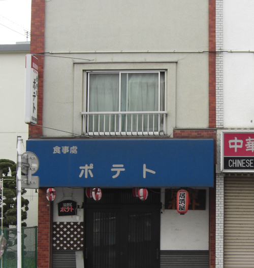
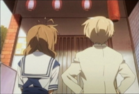

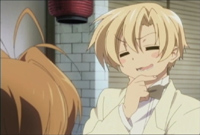

どんぐり山児童公園

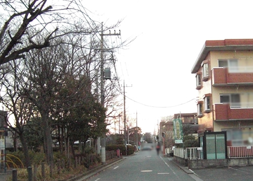

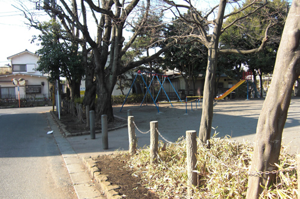

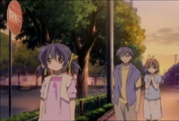

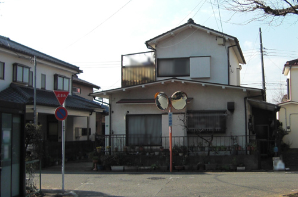

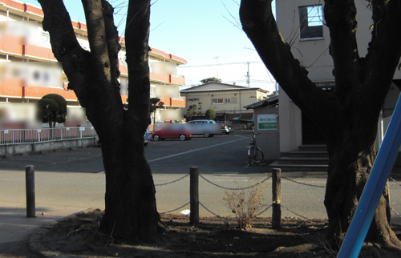 (方位有点off， 是因为秋千真实是斜着摆的)
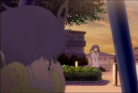

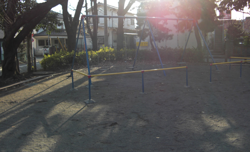
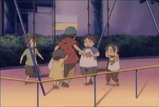

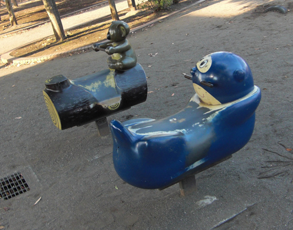

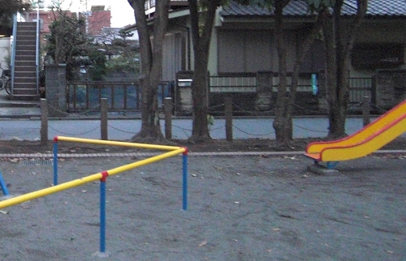

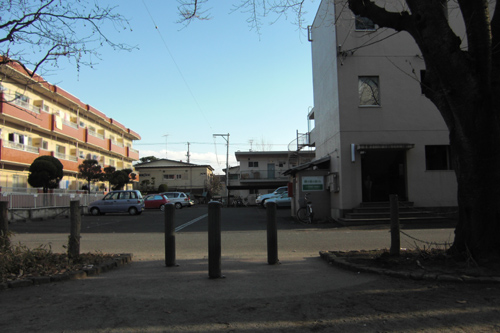

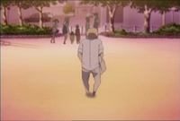

夜晚

(找不到)

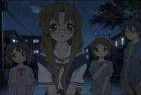

商店街

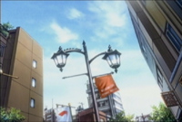

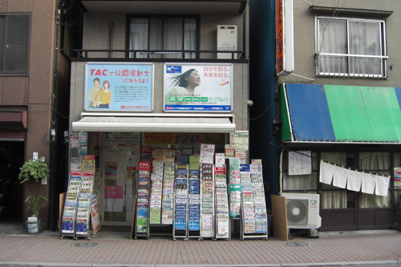
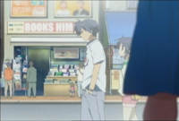

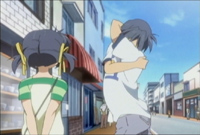
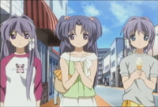

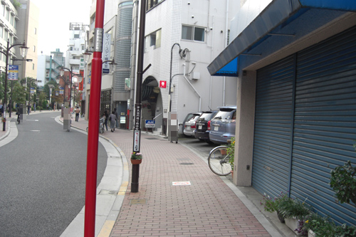

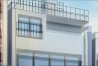
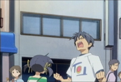

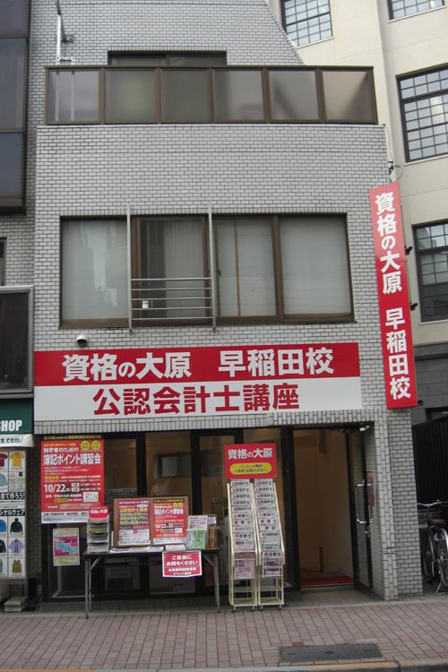
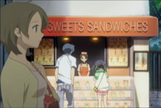
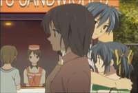

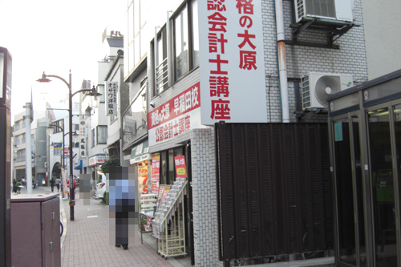
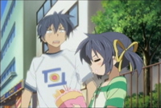

 (感觉这个游戏厅可能不存在)

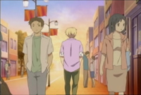

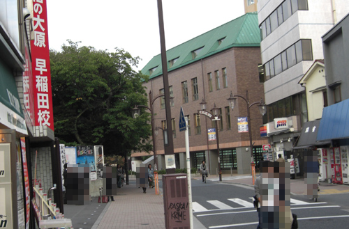

## 4. 笑容依旧

- 第二天, 春原没来学校
- 午餐, 椋杏琴美问起朋也和芽衣
  - 杏也说足球部的人不好, 体制特殊, 最好不要回去

- 光玉又多了一个(春原兄妹的?)

- 春原还是不在, 芽衣决定先去足球部请求以下
  - 被足球部数落一番
- 来到有纪宁咨询, 朋也讲起了春原
  - 春原在足球部被高年级欺负, 发生暴力事件, 
  - 正好朋也那时跟爸爸吵架伤了胳膊, 两人在教师室互相认识
- 有纪宁讲到自己的混混哥哥, 其实有很多优点但不善表达出来
  - 对的上之前早苗说的

- 上午春原来了, 还是有些生气, 朋也再次劝春原关心关心妹妹芽衣
  - 但对春原的态度很生气, 一时按耐不住差点吵起来, 被椋, 杏, 琴美制止
- 芽衣准备再去拜托, 但最终被拜托捡球, 还被足球部的故意欺负
- 当足球部说出春原其实直到渚,朋也,芽衣三人在做的事却依然不出现时, 芽衣彻底忍不住哭出来
  - 春原赶到, 朋也春原与足球部打起来

- 最终春原与朋也的冲突爆发在极点, 朋也谴责春原不好好关心芽衣,
  - 春原谴责朋也作为芽衣男朋友没有做到保护芽衣的责任
  - 直到春原看到渚还在旁边才恍然大悟

- 最后早苗误会解除

### Highlight 地点

common 樱花街道

## 2-4集总结

妹妹芽衣担心哥哥春原, 可是芽衣看到春原一副不在意的样子.
芽衣操碎了心, 希望通过回到足球部让哥哥振作起来, 但被欺负
期间朋也对春原不管不顾的态度越来越不爽, 直到两人再次打起来互相说出心声才化解,
两人友情依旧
