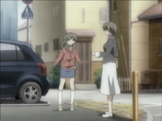
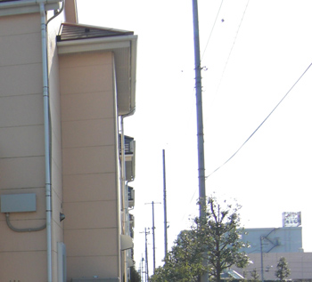

# Clannad After Story (Season 2) Episode 20 - 22 Plot Highlight

最终段，也是最虐的一段，虽然结局算好

## 20. 汐风的嬉戏

- 汐原本的幼儿园班主任回来了，是藤原杏
  - 杏和其他人也很担心，不过看到朋也恢复了也安心了

- 风子想主动找汐玩，芳野认为这个是让风子康复的好机会

- 有一天，汐自己跑出去，来到了医院

- 风子与汐好好的玩，期间不停地与朋也拌嘴
  - 汐也觉得很好玩
- 不过期间朋也无意中又沉浸在悲伤中时，风子也会用自己的方式担心起来

- 幼儿园运动会，需要亲子一起参加，朋也开始练习

- 有一天，汐又自己跑出来，遇见风子，跟风子说自己不知道为什么喜欢那个新建的医院（也是秋生曾经抱着渚来祈求复活渚的秘密花园，但医院已经建成）

- 运动会前，汐发高烧

### Highlight 地点

（与19话一样是被大火烧掉的京都动漫大楼）

 (原京都动漫大楼的旁边, 与19年的大火一并烧毁, 背景的房子已变, 只有围墙还在)

汐独自散步，common 朋也新家附近

汐独自散步的一段

汐独自散步，六道山公園

汐与风子再一次散步

- common 朋也新家

- 六道山公園

## 21. 世界的终结

- 汐的病症与渚一致，不明的高烧
  - 朋也听到这个消息很失落

- 光世界，机器人与少女仍在行走
  - 少女感到寒冷

- 一个月都没好，朋也打算辞职去照顾汐
- 久病不起的汐想要再次跟爸爸朋也旅游，但朋也没答应
  - 到此刻朋也再次憎恨起了小镇

- 秋生带着朋也再次来到新建的医院，朋也认为渚和汐都和小镇有了联系，然后大自然再不断地被开采，才生病的
  - 秋生认为新的医院和商店街都是好事，医院也是为了治病才建起来的

- 圣诞节，积蓄已经用光，朋也已经逐渐麻木，
  - 眼里再次看见光世界的光影
  - 对汐的照顾也不如之前
- 汐感觉到自己快不行了，强行让爸爸朋也带着汐再去那片花田
- 没走几步，汐感觉不行了，同时下雪了
  - 汐问爸爸喜不喜欢雪，但朋也为了安慰汐，忍住想起渚去世时的那场雪，说喜欢
  - 最后，朋也不断安慰生命垂危的汐
  - 汐去世后，朋也抱着汐痛苦，祈求有谁能救汐（就像秋生那时抱着渚一样）
  - 光世界回应了

- 光世界中，少女中途睡着，机器人叫起少女继续走，但是路途没有重点
  - 少女没走几步再次沉睡

- 再次回到第一集，朋也和渚初次相遇的地方和场景
  - 朋也再次犹豫起来，如果不搭话是不是就可以避免渚与汐的悲剧

### Highlight 地点

 (瑞穂郵便局から六道山公園へ)

六道山公園

 （お箸が重い认为这个地方是剧情里的新医院，因为高塔上面确实能照到21话中间的那个场景，但是新医院是千叶市立海滨医院，而实际上，医院的附近取景是六道山公園）

common 朋也新家

## 22. 小小的手心

- 光世界已是一片白雪，机器人和少女都倒下

- 时间暂停在最初第一集，在樱花坡道上，朋也和渚相遇
  - 光世界与现实世界交集

- 光世界，机器人后悔带着少女出发
- 在樱花坡道上，朋也后悔与渚相遇
- 光世界，机器人不像就这样算了
- 在樱花坡道上，渚正在下坡往回走
- 光世界，少女将不再是人的形态
  - 因此能听见机器人的声音
- 少女说自己梦见自己和机器人在很久以前曾同存在于现实世界
  - 机器人表示更应该一起回到原本的世界，再在一起生活
  - 少女自己便是光世界本身，不得不留下
  - 如果不留下，那些代表着现实世界人们的思念的那些光玉，就会消失，让现实世界人们变得不幸
  - 而这些光玉里，就有朋也（机器人）的
- 少女解释起：
  - 朋也同时存在于光世界和现实世界，少女（汐）过去也同朋也一起生活在现实世界
  - 两人跨越世界的距离，得以相见
  - 朋也在光世界的意识将会关闭，然后如galgame一样在现实世界重新来过
  - 那时候少女的思念会在现实世界化成无数光玉
  - （动漫缺少太多原作galgame里的解释，动漫党们请务必直接看这个[Stack Exchange上的Q&A](https://anime.stackexchange.com/questions/195/what-happens-at-the-end-of-clannad-after-story/258)）
  - 少女唱起团子大家族，13个光玉触发奇迹
  - 少女化作无数光玉

- 在樱花坡道上，时间开始流失
- 朋也最终不再迷茫，不再后悔与渚的相遇，一把叫住渚
  - 渚也不安，但欣慰朋也最终还是选择了她

- 现实世界时间倒转，光世界少女汐，带着机器人和朋也的思念，回到汐出生那一刻
  - 外面无数光玉上升，是光世界里的少女所化做的无数光玉
- 重新的时间线中，汐由朋也和渚养大，也去了奶奶的家

- 在风子前往医院的路上，见到了躺在树下的光世界汐

### Highlight 地点

common 樱花坡道

common 峡山池公园

陸奥横浜駅

其他

(与AF 17集一样)

还有很多TODO

最后一幕的风子

刚出来

已经走了一段

 (与20集汐独自散步一样)

六道山公園

お箸が重い[记录了其他场景](http://air.blue.coocan.jp/cla-af-22.html), 但个人认为牵强因此没记

最后OP的树

(很可惜, BV1km4y1b7oV认为这颗树已经没了)

但其实周边不少树都有这种稍微倾斜结构