# Clannad After Story (Season 2) Episode 5 - 6 Plot Highlight

美佐枝线, 2集结束, 本来原作gal里美佐枝线就短

## 5. 你曾在的季节

- 光世界, 机器人思考着光玉
  - 光玉是影子, 是别的世界什么本体的影子, 是别的世界孕育出来的光玉
  - 少女做了跷跷板
  - 机器人思考着少女之前一人的时候, 每天思考着什么
  - 少女说如果能流泪就好了
  - 机器人认为天空与另一个世界相连

- 渚和朋也给春原送饭, 遇见美佐枝教训春原不准卖猫
- 智代也为咨询当学生会长建议而来
  - 能看出美佐枝其实很有人气, 大家都来找她寻求帮助
- 大家走后, 美佐枝与渚继续聊
  - 猫来找朋也"聊"

- 猫曾是志麻贺津纪, 需要带着装有光玉的守护符找美佐枝为她实现愿望
- 志麻贺一出场打扰了美佐枝的表白, 志麻表示他是来实现愿望的
- 美佐枝与志麻来到喷泉公园, 志麻讲起了以前美佐枝在医院鼓励志麻的事
  - 顺便再次提起可以实现任何愿望的光玉, 但美佐枝属于现实主义不信
- 志麻来学校再找她, 看出美佐枝喜欢一位学长
  - 问及愿望是不是希望和学长结婚时, 美佐枝不希望志麻用光玉去实现这个愿望, 去随意操纵他人
- 志麻的出现再次让学长误会
- 志麻与美佐枝再次来到公园
  - 美佐枝对志麻不吃醋纯真的性格感到不讨厌
- 志麻依然每天都在校门口接美佐枝, 即使下雨
- 然而学长找到志麻, 希望志麻能委婉地转告美佐枝学长已有女朋友
- 在さくら板桥上, 志麻尝试以第三人称视角委婉说出现在三角关系情况
  - 但是美佐枝没听出来志麻再说自己, 反倒说安慰正在失落地女孩是最好地功率机会
  - 当美佐枝看到学长与女朋友谈笑说话时, 美佐枝才明白, 
  - 也困惑为什么志麻在伤心

### Highlight 地点

common 春原宿舍

common 樱花坡道

峡山池公园

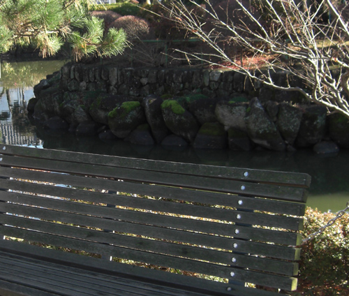
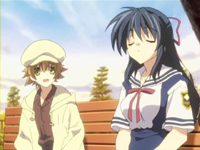

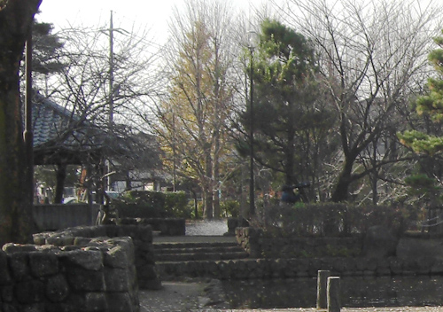

さくら板

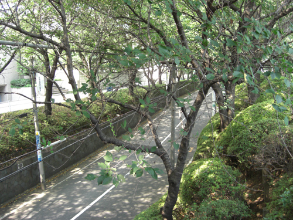

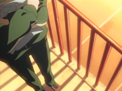

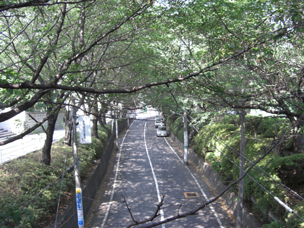

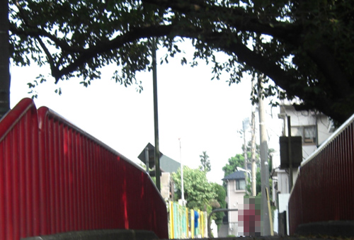

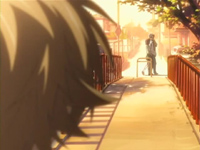
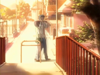

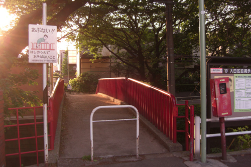

## 6. 一直在你身旁

- 志麻照常来学校等美佐枝, 但是美佐枝没有来
  - 美佐枝地同学认为志麻更适合美佐枝, 希望他去安慰美佐枝

- 志麻在同学们的怂恿下来到公园见到美佐枝, 先说一些美佐枝同学教的话
  - 志麻向美佐枝道歉, 但也在美佐枝的询问下承认自己喜欢美佐枝
  - 志麻说:"喜欢你训斥我, 担心我, 施展摔跤术时候身上的香味也喜欢"

- 美佐枝越来越喜欢跟志麻在一起, 还邀请去秋祭奠
- 有一次美佐枝学生会长工作比较晚, 志麻想去看看
  - 被美佐枝同学恶搞, 女装进学校还对美佐枝说了女同的话
  - 志麻再次看到自己身上的守护符, 想起了自己还需要实现美佐枝的愿望
- 美佐枝同学决定去志麻家里, 但志麻这时看到妈妈才想起来自己并不是真正的志麻, 真正的志麻已经去世
  - 在喷泉公园, 美佐枝同学安慰志麻
  - 志麻想起自己只是拖真正的志麻在去世之前把最后的愿望托付给了自己

- 在秋祭奠上, 志麻赠与美佐枝光玉护符, 但光玉不在
  - 美佐枝说出愿望, 希望志麻一直喜欢着她
- 志麻也喜欢着美佐枝, 愿望实现, 志麻变回猫🐱

- 后来有一只猫一直跟随着美佐枝, 一直到美佐枝毕业去男生宿舍当宿管
  - 有一瞬间, 美佐枝曾想过, 这只猫就是志麻

- 托梦结束, 朋也醒来
- 在秋祭奠, 朋也将猫托梦希望传达的话和道歉说给了美佐枝
- 美佐枝明白了猫是志麻, 也打算按照猫的愿望, 决定寻找幸福

- 天空的光玉

### Highlight 地点

峡山池公园

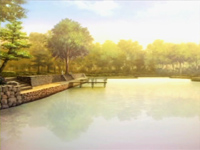

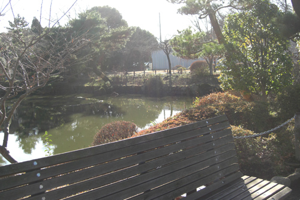
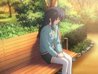

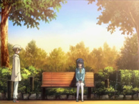

 (这个角度跟第一季第8集风子他们第一次去这个公园是一个角度)

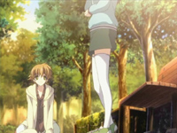

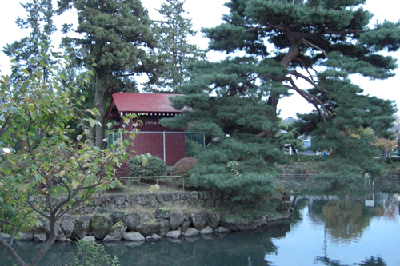
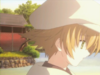

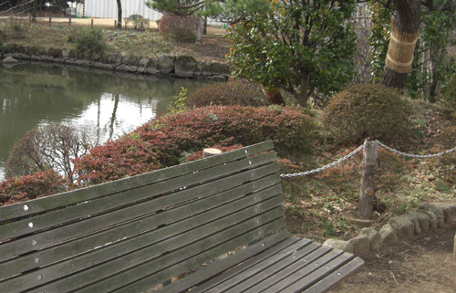

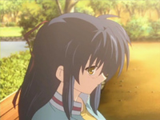

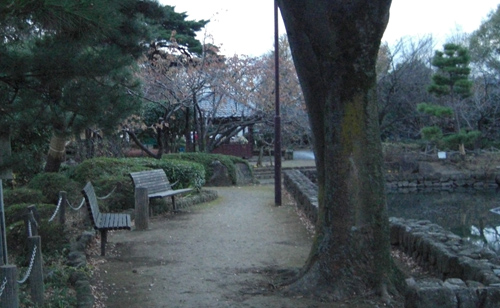

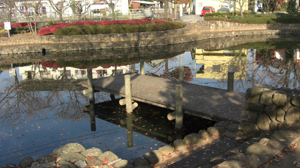
 (这角度对吗)

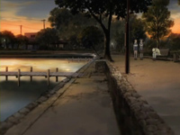
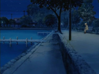

去志麻家路上

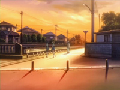

神社 (与第一季琴美线遇见的神社是同一个)

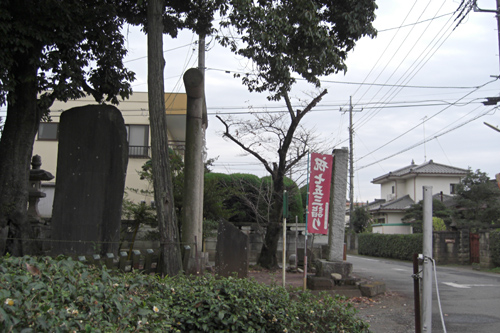

