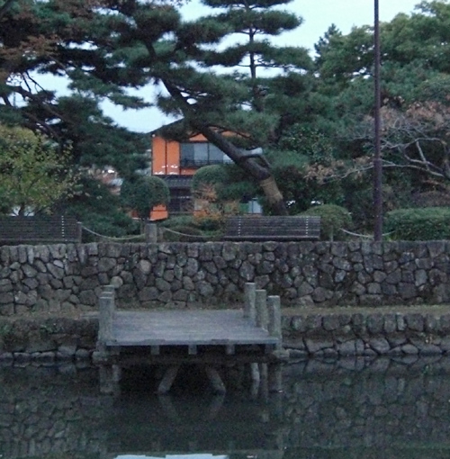
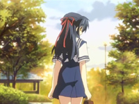
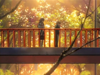
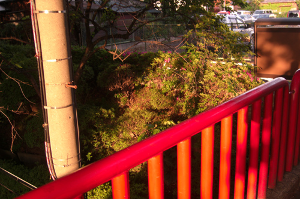
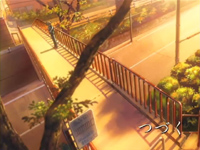

# Clannad After Story (Season 2) Episode 5 - 6 Plot Highlight

美佐枝线, 一话结束, 本来原作gal里美佐枝线就短

## 5. 你曾在的季节

- 光世界, 机器人思考着光玉
  - 光玉是影子, 是别的世界什么本体的影子, 是别的世界孕育出来的光玉
  - 少女做了跷跷板
  - 机器人思考着少女之前一人的时候, 每天思考着什么
  - 少女说如果能流泪就好了
  - 机器人认为天空与另一个世界相连

- 渚和朋也给春原送饭, 遇见美佐枝教训春原不准卖猫
- 智代也为咨询当学生会长建议而来
  - 能看出美佐枝其实很有人气, 大家都来找她寻求帮助
- 大家走后, 美佐枝与渚继续聊
  - 猫来找朋也"聊"

- 猫曾是志麻贺津纪, 需要带着装有光玉的守护符找美佐枝为她实现愿望
- 志麻贺一出场打扰了美佐枝的表白, 志麻表示他是来实现愿望的
- 美佐枝与志麻来到喷泉公园, 志麻讲起了以前美佐枝在医院鼓励志麻的事
  - 顺便再次提起可以实现任何愿望的光玉, 但美佐枝属于现实主义不信
- 志麻来学校再找她, 看出美佐枝喜欢一位学长
  - 问及愿望是不是希望和学长结婚时, 美佐枝不希望志麻用光玉去实现这个愿望, 去随意操纵他人
- 志麻的出现再次让学长误会
- 志麻与美佐枝再次来到公园
  - 美佐枝对志麻不吃醋纯真的性格感到不讨厌
- 志麻依然每天都在校门口接美佐枝, 即使下雨
- 然而学长找到志麻, 希望志麻能委婉地转告美佐枝学长已有女朋友
- 在さくら板桥上, 志麻尝试以第三人称视角委婉说出现在三角关系情况
  - 但是美佐枝没听出来志麻再说自己, 反倒说安慰正在失落地女孩是最好地功率机会
  - 当美佐枝看到学长与女朋友谈笑说话时, 美佐枝才明白, 
  - 也困惑为什么志麻在伤心

### Highlight 地点

common 春原宿舍

common 樱花坡道

峡山池公园

さくら板

