# Clannad After Story (Season 2) Episode 7-8 Plot Highlight

有纪宁线

## 7. 她的「家」

- 光世界, 机器人看见两道光玉闪烁在一起, 代表有什么在改变
- 随着冬天到来, 少女睡觉时间越来越长, 下雪的云也在慢慢向这边扩展
- 机器人下定决心, 准备带着少女离开家, 前往温暖的世界

- 一个受伤小混混须藤进来了, 比较失落, 有纪宁安慰振作

- 第9个光玉出现了(有纪宁的)

- 介绍了有纪宁的哥哥是其中一方混混的老大, 行踪不明, 有纪宁经常照顾受伤的混混
- 来了一位叫勇的弟弟, 尝试通过从有纪宁这里找到加入了混混组的姐姐
  - 春原看对方弱小, 借机耍帅说是有纪宁的哥哥
  - 有纪宁展示出仁爱的一点, 和平解决了问题, 并找到了勇的姐姐
  - 然而春原的耍帅导致对方混混准备有所行动

- 在夜店, 姐弟重逢
  - 顺便春原谎言戳穿
- 有纪宁提到勇姐姐就是与家人吵架才离家的
  - 这里很多人都是离家出走的
  - 只要有类似家人的存在, 人就不会走错路

- 回去的路上, 春原的误会闹大了, 对方混混来找春原

### Highlight 地点

common 樱花坡道

木津川

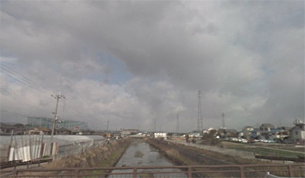

隧道

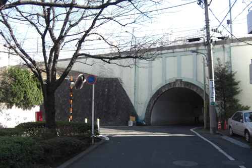
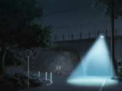

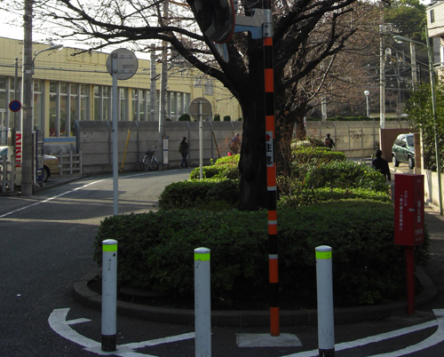
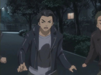

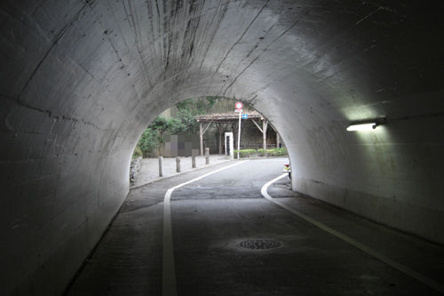

## 8. 英勇的战斗

- 有纪宁昨晚没睡好, 渚建议朋也为有纪宁枕膝

- 须藤混混报告对方认为有纪宁哥哥出院, 已没有胜算, 绝望地攻过来了
- 智代正好过来来劝告有纪宁让混混们不要继续打架, 否则警察会介入
- 有纪宁照顾的混混们受伤严重, 有纪宁决定跟对方谈, 即使朋也劝告
- 对方的老大决定两方老大出来单挑
- 这边的混混不知道怎么办, 但把春原顶上去了

- 第二天, 两边对决
- 渚带来的七彩面包让所有人都晕了
- 只剩下朋也, 决定代替去战斗了
  - 朋也一直斗到这边的混混起来
  - 但也即将变成两方混战
- 此时有纪宁伪装成哥哥的样子出现, 只为了结束斗争
- 最后两方和好, 一起去有纪宁哥哥的墓地, 纪念哥哥
  - 光玉出现

- 有纪宁揭秘光玉
  - 在幸福的瞬间, 光玉就会出现
  - 如果获得这个光玉, 就可以实现一个愿望
  - 朋也能看见, 说明特殊

### Highlight 地点

桥

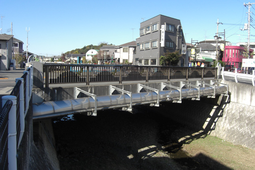 (注意朋也和有纪宁站着的是有管子的桥)
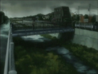

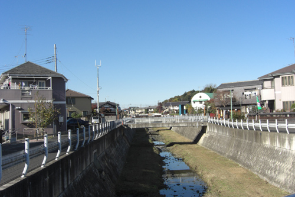
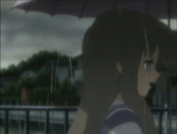

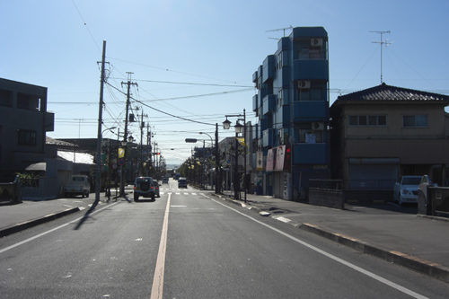

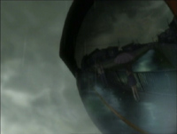

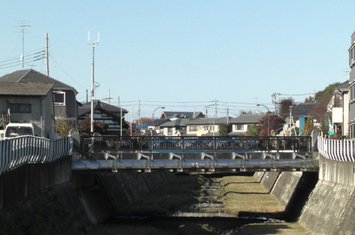
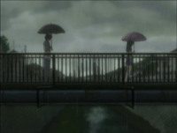

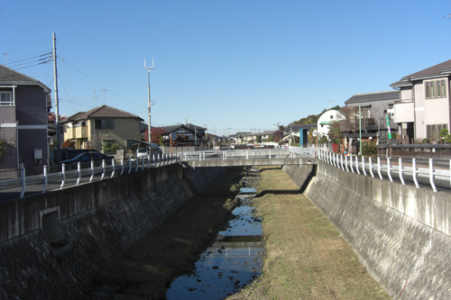
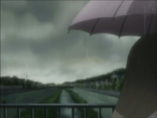
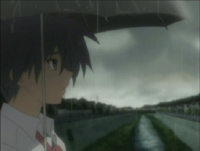

瑞穂ビューパーク手前、慰霊碑の丘

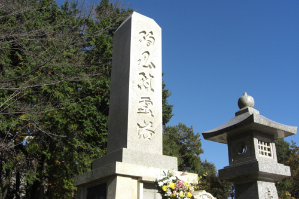
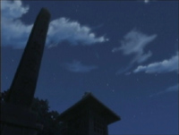

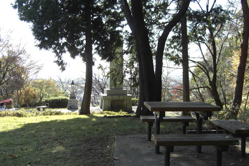 (座位位置不对, 但不知道傍边有没有位置)
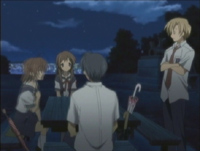

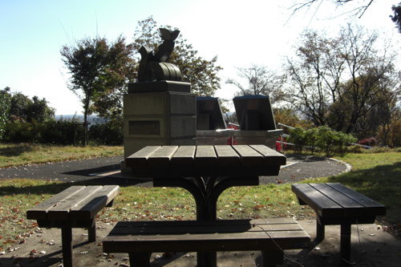

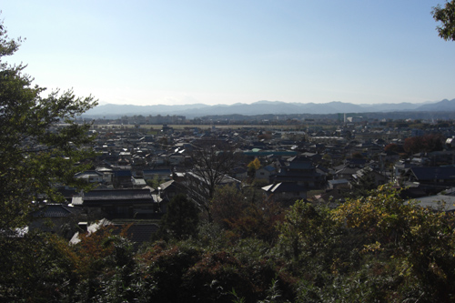
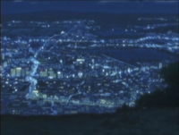

common 八幡市木津川

墓地
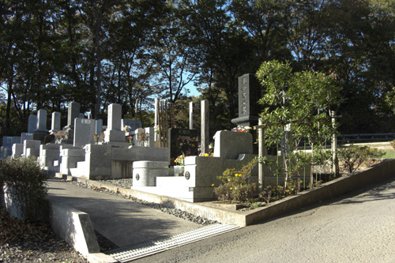
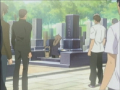

## 7-8集总结

讲述了离家出走的人们再次聚集出一个家的故事
有纪宁继承哥哥的意志尝试着让互相打架的两波混混和好
