# Clannad After Story (Season 2) Episode 9 - Plot Highlight

## 9. 坡道的途中

- 光世界, 机器人和少女开始拼装飞机, 为了去那边快乐温暖的真实世界
  - 随着冬天到来, 少女开始犯困

- 即将毕业, 渚打算直接找工作, 朋也逃避了渚询问志愿, 但同意约会
- 大家交流了志愿, 椋->护士, 杏->幼儿园老师, 琴美->美国留学
- 渚发烧生病了
- 大家想去看望渚, 但朋也拒绝说渚去医院
  - 大家看出来并担心朋也没精神
- 一个月过去, 渚依然没有好转, 朋也除了上学就是陪着
- 到了冬天, 因为出勤率不够, 渚需要再读一次三年级
  - 朋也对自己的女朋友渚无法毕业而感到
- 平安夜, 渚的生日, 大家为渚庆生, 朋也送了大团子

- 毕业仪式, 朋也和春原向老爷子告别, 感谢老爷子让朋也和春原相遇
- 智代和有纪宁升为三年级, 其他人去毕业party了
- 朋也回家, 渚在门口迎接, 也解开朋也想要为了渚而留学的心结

### Highlight 地点

common 樱花坡道

渚尝试生病上学的一条道 (个人认为不像比较牵强)

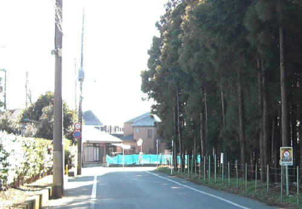
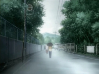

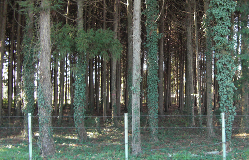

## 10. 开始的季节

- 光世界, 正在组装飞机
  - 冬天到来, 少女就会睡去, 机器人也不知道怎么办

- 第10个光玉出现 (毕业?)

- 朋也先在古河面包店帮忙
  - 上午最忙, 下午较闲
- 渚则去上学
- 下午, 早苗也会教课
- 秋生与早苗的日常互动, 一家人其乐融融
- 渚在学校也不顺利, 演剧部也结束了

- 朋也开始考虑其他工作, 看看房子
  - 遇到方野
- 街上遇到杏和椋, 聊起毕业后的事
  - 椋介绍了一个房租便宜的老公寓
  - 朋也决定去方野那边工作, 并搬出古河面包店
- 秋生最后忠告, 有困难一定要跟秋生早苗他们说, 因为社会很复杂
- 朋也认为自己已独立, 但在秋生看来他还很嫩
  - 朋也试探是不是可以求婚, 大叔思考了一会
- 搬家了
  - 看到有一天会过上了夫妇二人生活, 朋也感到兴奋
  - 虽然渚还在上学, 但会过来做早饭晚饭
  - 想到这里朋也很高兴
- 朋也去上班了
  - 给人的感觉不一样, 也期待着能组成家庭
- 第一天工作不习惯, 很累
  - 回来后渚做了晚餐, 全身疼也很累, 很困, 吃饭时就睡着了
  - 寓意着朋也正式步入社会

### Highlight 地点

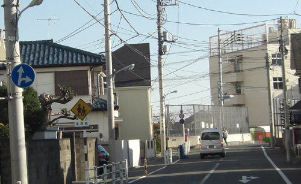
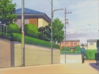

方野和电线杆

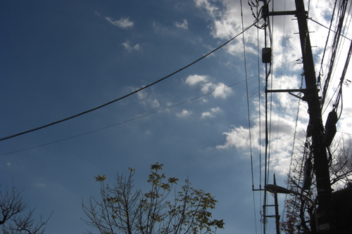
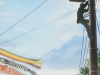

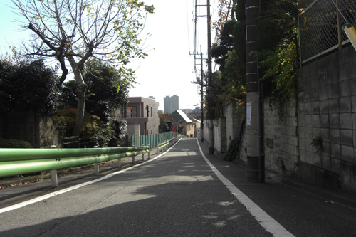
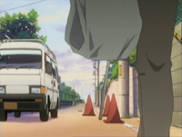

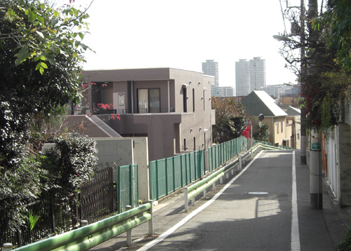
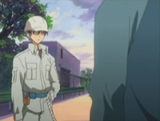

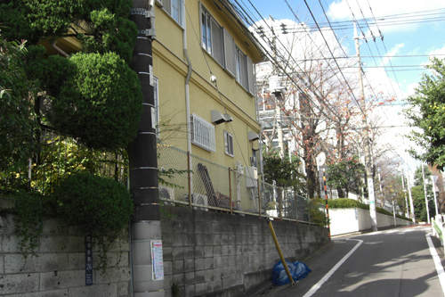
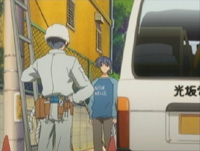

商店街

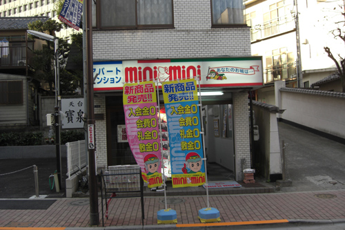
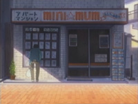

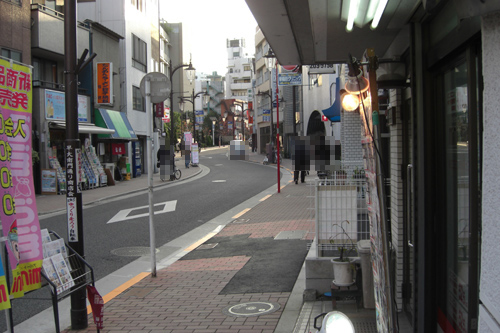
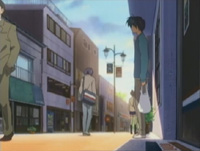
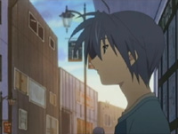

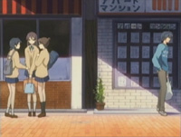

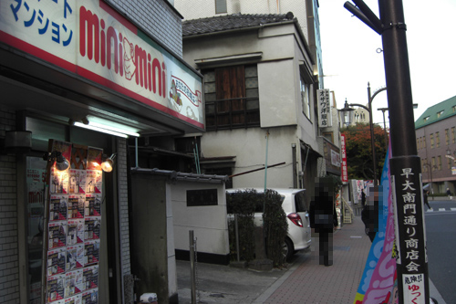
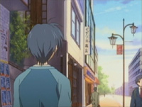

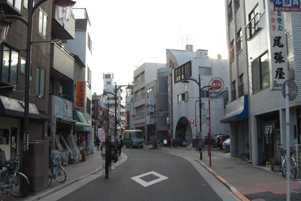

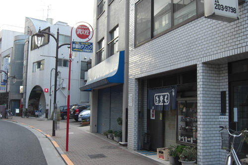
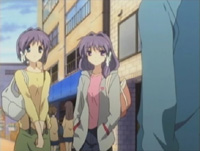

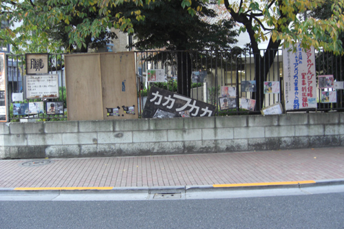
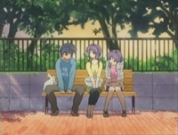

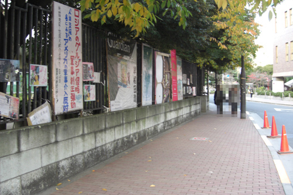

回到方野和电线杆

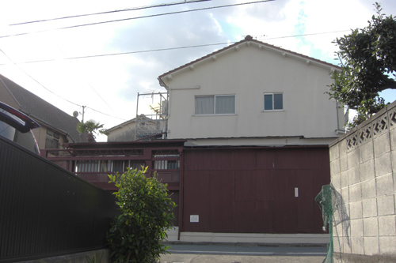
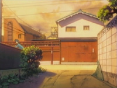

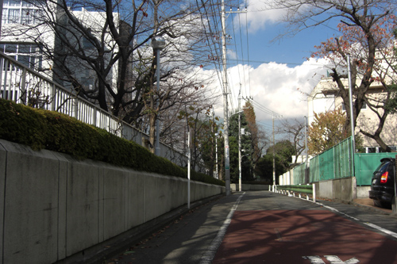

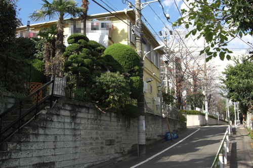
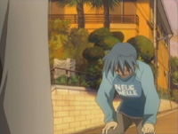

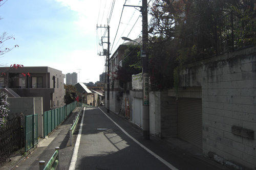
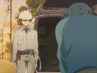

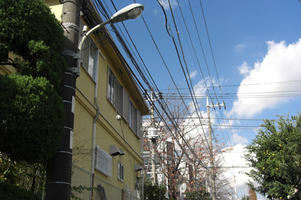
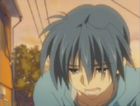

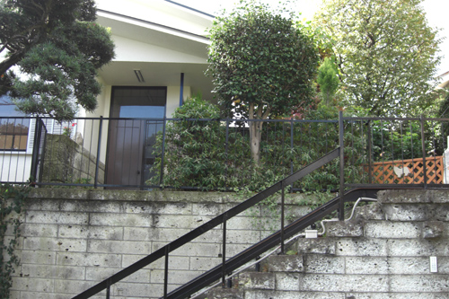
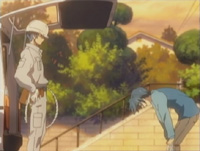

common 朋也新家

新家旁边

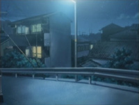

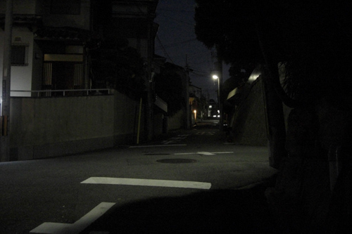

之后是方野和朋也开车去修电线杆路过的地方， 但因为お箸が重い在圣地巡礼时就已经面目全非而放弃, 详情见[お箸が重い的CLANNAD AF 第10集攻略](http://air.blue.coocan.jp/cla-af-10.html)

